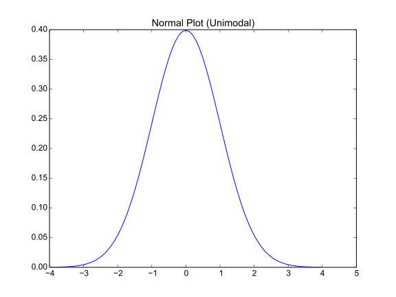
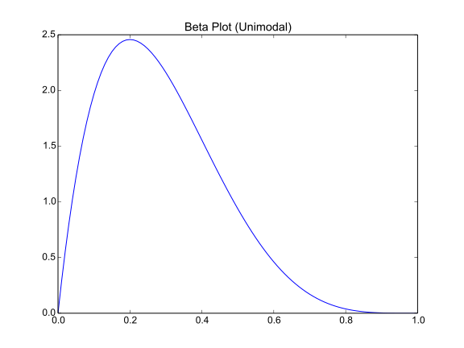
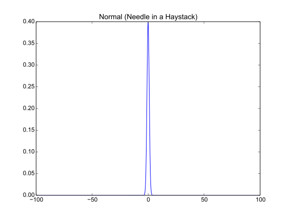
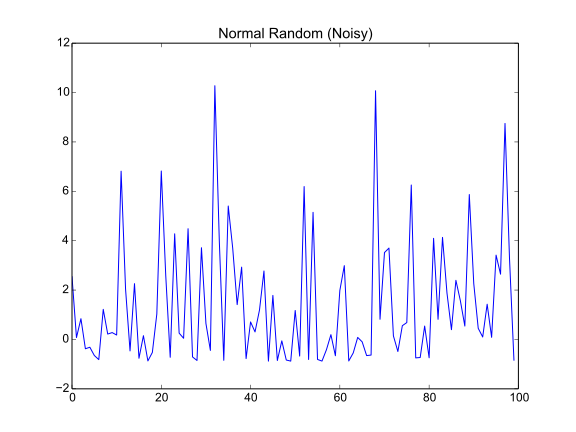
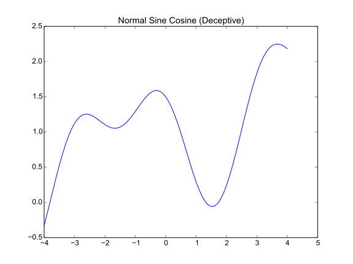

Data Types
==========

In [EOM] four types of data are identified:

    * Unimodal
    * Needle in a haystack
    * Noisy
    * Decpetive

Here are how we can approximate some of these types.

Unimodal
--------

A normal distribution.

.. currentmodule:: scipy
.. autosummary::
   :toctree: api

   arange
   stats
   stats.norm
   stats.norm.pdf

::

    x = scipy.arange(-4, 4.1, 0.1)
    y = scipy.stats.norm.pdf(x)
    
    

A Beta Distribution.

.. autosummary::
   :toctree: api

   stats.beta
   stats.beta.pdf

::

    x = scipy.arange(0, 1.01, 0.01)
    y = scipy.stats.beta.pdf(x, 2, 5)
    
    

Needle In A Haystack
--------------------

This is another normal distribution but with long tails.

::

    x = scipy.arange(-100, 100.1, 0.1)
    y =  scipy.stats.norm.pdf(x)
    
    

Noisy
-----

This is a random sampling from a normal distribution with additional terms added.

.. math::

   y &= randomSample()\\
   y' &= y^2 + \sin (y)\\

.. '   
   
::

    y = scipy.stats.norm.rvs(size=100)
    y += y**2 + scipy.sin(y)
    
    

Deceptive
---------

This isn't really the same as the 'deceptive' data described in [EOM] but it does have local and global maxima.

.. '

.. math::

   y = cdf(x) + \cos^2 x - \sin x\\

::

    x = scipy.arange(-4, 4.1, 0.1)
    y = scipy.stats.norm.cdf(x) + scipy.cos(x)**2 - scipy.sin(x)
    
    

