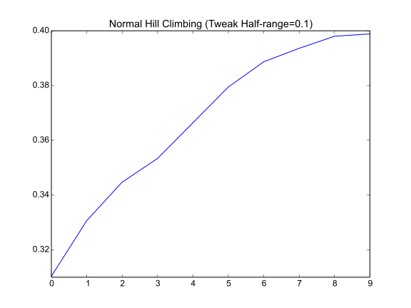
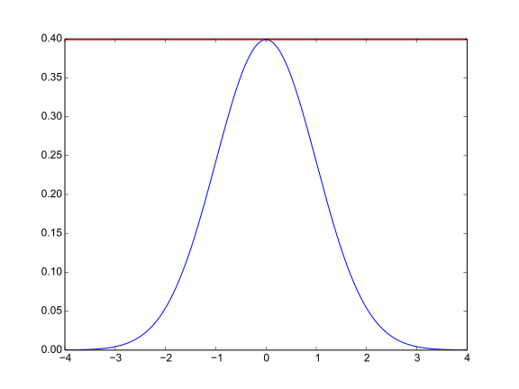
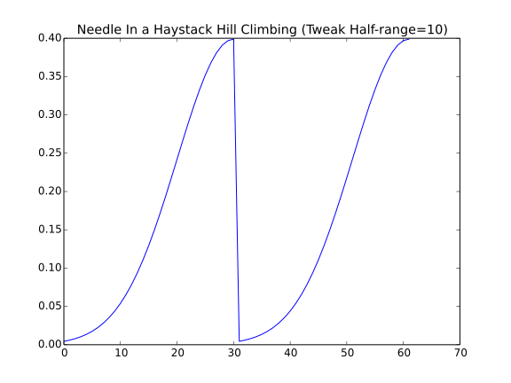
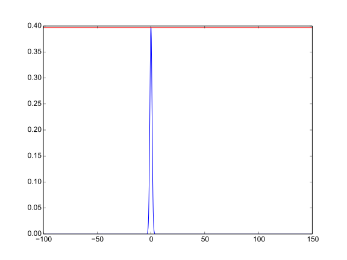

The Steepest Ascent Hill Climber (With Replacement)
===================================================

*Steepest Ascent Hill-Climbing With Replacement* makes the search more aggresive than a regular hill-climber by sampling multiple times around the current candidate solution _[EOM].

.. uml::

   BaseClimber <|-- SteepestAscent

.. currentmodule:: optimization.optimizers.steepestascent
.. autosummary::
   :toctree: api

   SteepestAscent
   SteepestAscent.__call__

The SteepestAscent climber is more aggresive than the hill-climber but still has a problem with local-optima so I'll just test it on the normal-data here.

.. '

.. uml::

   HillClimber o- XYSolution
   HillClimber o- XYTweak
   HillClimber o- UniformConvolution
   HillClimber o- StopConditionIdeal
   HillClimber o- NormalSimulation

.. currentmodule:: optimization.simulations.normalsimulation
.. autosummary::
   :toctree: api

   NormalSimulation
.. currentmodule:: optimization.components.stopcondition 
.. autosummary::
   :toctree: api

   StopConditionIdeal
   
.. currentmodule:: optimization.components.convolutions 
.. autosummary::
   :toctree: api

   UniformConvolution
   
.. currentmodule:: optimization.components.xysolution 
.. autosummary::
   :toctree: api

   XYSolution
   XYTweak

::

    IN_PWEAVE = __name__ == '__builtin__'
    #IN_PWEAVE = True
    def run_climber(climber):
        start = time.time()
        solution = climber()
        end = time.time()
        print "solution: {0}".format(solution)
        print "Ideal: {0}".format(simulator.ideal_solution)
        print "Difference: {0}".format(solution.output - simulator.ideal_solution)
        print "Elapsed: {0}".format(end - start)
        return
    
    if IN_PWEAVE:
        from optimization.simulations.normalsimulation import NormalSimulation
        from optimization.components.stopcondition import StopConditionIdeal
        from optimization.components.convolutions import UniformConvolution
        from optimization.components.xysolution import XYSolution, XYTweak
        import time
        import numpy
        import matplotlib.pyplot as plt
    
        simulator = NormalSimulation(domain_start=-4,
                                     domain_end=4,
                                     domain_step=0.1)
    
        stop = StopConditionIdeal(ideal_value=simulator.ideal_solution,
                                  delta=0.0001,
                                  time_limit=300)
        
        tweak = UniformConvolution(half_range=0.1,
                                   lower_bound=simulator.domain_start,
                                   upper_bound=simulator.domain_end)
    
        xytweak = XYTweak(tweak)
        inputs = numpy.random.uniform(simulator.domain_start,
                                      simulator.domain_end,
                                      size=1)
        candidate = XYSolution(inputs=inputs)
    
        # this is a kludge until I get the call-ordering worked out
        # right now the simulator is setting the .output as a side-effect
        simulator(candidate)
        
        climber = SteepestAscent(solution=candidate,
                                 stop_condition=stop,
                                 tweak=xytweak,
                                 quality=simulator,
                                 local_searches=4)
        run_climber(climber)
    
    def plot_solutions(filename, climber, title):
        output = 'figures/{0}.svg'.format(filename)
        figure = plt.figure()
        axe = figure.gca()
        data = [solution.output for solution in climber.solutions]
        axe.plot(data)
        axe.set_title(title)
        figure.savefig(output)
        print '.. figure:: '  + output
        return
    
    def plot_dataset(filename, climber, simulator, title):
        output = 'figures/{0}.svg'.format(filename)
        figure = plt.figure()
        axe = figure.gca()
        axe.plot(simulator.domain, simulator.range)
        axe.axhline(climber.solution.output, color='r')
        figure.savefig(output)
        print ".. figure:: " + output
        return
    

::

    Inputs: [ 3.04371109] Output: 0.00443184841194
    Inputs: [ 2.91879339] Output: 0.00595253241978
    Inputs: [ 2.83437595] Output: 0.00791545158298
    Inputs: [ 2.74013943] Output: 0.0104209348144
    Inputs: [ 2.60469089] Output: 0.0135829692337
    Inputs: [ 2.51023048] Output: 0.0175283004936
    Inputs: [ 2.42960723] Output: 0.0223945302948
    Inputs: [ 2.32910777] Output: 0.0283270377416
    Inputs: [ 2.22511114] Output: 0.0354745928462
    Inputs: [ 2.1332202] Output: 0.0439835959804
    Inputs: [ 2.02296916] Output: 0.0539909665132
    Inputs: [ 1.93743168] Output: 0.0656158147747
    Inputs: [ 1.81336704] Output: 0.0789501583009
    Inputs: [ 1.74424518] Output: 0.0940490773769
    Inputs: [ 1.57852444] Output: 0.110920834679
    Inputs: [ 1.4977735] Output: 0.129517595666
    Inputs: [ 1.43816743] Output: 0.149727465636
    Inputs: [ 1.34152775] Output: 0.171368592048
    Inputs: [ 1.2476231] Output: 0.194186054983
    Inputs: [ 1.14875645] Output: 0.217852177033
    Inputs: [ 1.04290908] Output: 0.241970724519
    Inputs: [ 0.90005964] Output: 0.266085249899
    Inputs: [ 0.84635775] Output: 0.289691552761
    Inputs: [ 0.69487702] Output: 0.312253933367
    Inputs: [ 0.6119632] Output: 0.333224602892
    Inputs: [ 0.54331945] Output: 0.352065326764
    Inputs: [ 0.41271049] Output: 0.368270140303
    Inputs: [ 0.33811882] Output: 0.381387815461
    Inputs: [ 0.19625808] Output: 0.391042693975
    Inputs: [ 0.14073304] Output: 0.396952547477
    Inputs: [ 0.04524628] Output: 0.398942280401
    solution: Inputs: [ 0.04524628] Output: 0.398942280401
    Ideal: 0.398942280401
    Difference: 0.0
    Elapsed: 0.0172560214996
    

Now a :ref:`Needle in a Haystack <optimization-simulations-needle-in-haystack>` case.

::

    if IN_PWEAVE:
        # make the target different so we know the data changed
        simulator.reset()
        #simulator.functions = [lambda x: 10 * x + 5]
        simulator.domain_start = -100
        simulator.domain_end = 150
        simulator.domain_step = 0.1
        candidate.output = None
        simulator(candidate)
        climber.solution = candidate
        climber.emit = False
    
        stop._end_time = None
        stop.ideal_value = simulator.ideal_solution
    
        # this takes forever, make it lenient
        tweak = UniformConvolution(half_range=0.1,
                                   lower_bound=simulator.domain_start,
                                   upper_bound=simulator.domain_end)
    
        xytweak = XYTweak(tweak)
    
        stop.delta = 0.001
    
        climber.tweak = xytweak
        print "Ideal: {0}".format(simulator.ideal_solution)
        run_climber(climber)
    

::

    Ideal: 0.398942280401
    solution: Inputs: [ 0.03161969] Output: 0.398942280401
    Ideal: 0.398942280401
    Difference: 0.0
    Elapsed: 0.00948214530945
    

