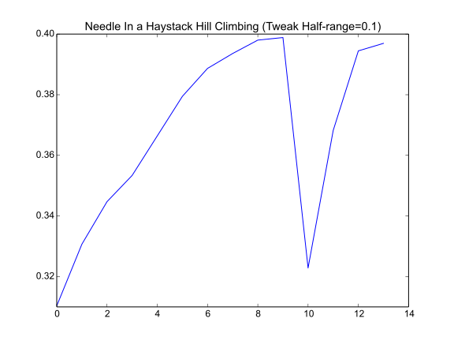

The Steepest Ascent Hill Climber (With Replacement)
===================================================

*Steepest Ascent Hill-Climbing With Replacement* makes the search more aggresive than a regular hill-climber by sampling multiple times around the current candidate solution [EOM]_.

Contents:

   * :ref:`SteepestAscent Class <optimization-optimizers-steepestascent>`
   * :ref:`Normal Distribution Example <optimization-optimizers-steepestascent-normalexample>`
   * :ref:`Needle in a Haystack Example <optimization-optimizers-steepestascent-needleinahaystack>`   
   * :ref:`Gaussian Convolution Noisy Example <optimization-optimizers-steepestascent-gaussianconvolution>`
   * :ref:`Gaussian Convolution Normal Example <optimization-optimizers-steepestascent-gaussianconvolution-normal>`

.. _optimization-optimizers-steepestascent:

SteepestAscent Class
--------------------

.. uml::

   BaseClimber <|-- SteepestAscent

.. currentmodule:: optimization.optimizers.steepestascent
.. autosummary::
   :toctree: api

   SteepestAscent
   SteepestAscent.__call__

.. _optimization-optimizers-steepestascent-normalexample:

A Normal Distribution Example
-----------------------------

The SteepestAscent climber with UniformConvolution is more aggresive than the hill-climber but still has a problem with local-optima so I'll just test it on the normal-data here.

.. '

.. uml::

   HillClimber o- XYSolution
   HillClimber o- XYTweak
   HillClimber o- UniformConvolution
   HillClimber o- StopConditionIdeal
   HillClimber o- NormalSimulation

.. currentmodule:: optimization.simulations.normalsimulation
.. autosummary::
   :toctree: api

   NormalSimulation
.. currentmodule:: optimization.components.stopcondition 
.. autosummary::
   :toctree: api

   StopConditionIdeal
   
.. currentmodule:: optimization.components.convolutions 
.. autosummary::
   :toctree: api

   UniformConvolution
   
.. currentmodule:: optimization.components.xysolution 
.. autosummary::
   :toctree: api

   XYSolution
   XYTweak

::

    if IN_PWEAVE:
        # python standard library
        from collections import OrderedDict
        
        # third party
        import numpy
        
        # this package
        from optimization.simulations.normalsimulation import NormalSimulation
        from optimization.components.stopcondition import StopConditionIdeal
        from optimization.components.convolutions import UniformConvolution, GaussianConvolution
        from optimization.components.xysolution import XYSolution, XYTweak        
    
        outcomes = OrderedDict()
        simulator = NormalSimulation(domain_start=-4,
                                     domain_end=4,
                                     steps=1000)
    
        stop = StopConditionIdeal(ideal_value=simulator.ideal_solution,
                                      delta=0.0001,
                                      time_limit=300)
        
        tweak = UniformConvolution(half_range=0.1,
                                   lower_bound=simulator.domain_start,
                                   upper_bound=simulator.domain_end)
    
        xytweak = XYTweak(tweak)
        # try a bad-case to start 
        inputs = numpy.array([simulator.domain_start])
        candidate = XYSolution(inputs=inputs)
    
        climber = SteepestAscent(solution=candidate,
                                 stop_condition=stop,
                                 tweak=xytweak,
                                 quality=simulator,
                                 local_searches=4)
        outcomes['Uniform Normal'] = run_climber(climber)
    

::

    Solution: Inputs: [-0.02257583] Output: 0.398862340139
    Ideal: 0.398939082483
    Difference: -7.67423442817e-05
    Elapsed: 0.00820899009705
    Quality Checks: 591
    Comparisons: 295.0
    Solutions: 56
    Solutions/Comparisons: 0.189830508475
    

The number of quality checks is related to the number of comparisons made between candidate solutions::

    if Quality(solution) > Quality(candidate):
        solution = candidate

Each comparison uses two checks and there is an initializing check before the optimization starts (to establish the first candidate as the best solution found so far). So the total number of comparisons is:

.. math::

   Comparisons &\gets \frac{QualityChecks - 1}{2}\\

.. figure:: figures/normal_steepest_ascent.svg

The x-axis in the figure shows the number of times a better solution was found and the y-axis is the value (quality) of the solution. In this case the solution is a point on the x-axis and the quality is the height of the curve for the solution.

.. figure:: figures/steepest_ascent_normal_data.svg

Changing the Parameters
-----------------------

The two main parameters that will affect the performance of the climber will be the number of local searches (``SteepestAscent.local_searches``) it does and the size of the random changes it makes (``UniformConvolution.half_range``). In this case we know that the input-data is actually one-dimensional and the distribution is unimodal so it might help to reduce the number of local searches and increase the half-range to see if it will climb faster.

::

    if IN_PWEAVE:
        candidate.output = None
        climber._solutions = None
        climber.solution = candidate
        stop._end_time = None
        climber.local_searches = 8
        tweak.half_range = 1
        run_climber(climber)
    
    

::

    Solution: Inputs: [-0.01083808] Output: 0.398913500061
    Ideal: 0.398939082483
    Difference: -2.5582421894e-05
    Elapsed: 0.00162792205811
    Quality Checks: 700
    Comparisons: 349.5
    Solutions: 6
    Solutions/Comparisons: 0.0171673819742
    
    

I tried it with different numbers of local-search values and it actually seems to take longer if you go with either fewer or more of them. I guess if there are too few then you run a greater risk of moving in the wrong-direction and if there are too many you multiply the number of searches you make before checking the overall-best solution so it inevitably uses more comparisons. I guess the parameters have to be tuned according to the data with a certain amount of trial and error.

.. _optimization-optimizers-steepestascent-needleinahaystack:

Needle In a Haystack
--------------------

Now a :ref:`Needle in a Haystack <optimization-simulations-needle-in-haystack>` case.

::

    if IN_PWEAVE:
        simulator.reset()
        simulator.domain_start = -100
        simulator.domain_end = 150
        simulator.steps = 10000
        
        candidate.output = None
        climber._solutions = None
        climber.solution = candidate
        climber.emit = False
    
        stop._end_time = None
        stop.ideal_value = simulator.ideal_solution
        stop.delta = 0.001
    
        outcomes['Uniform Needle'] = run_climber(climber)
    

::

    Solution: Inputs: [-0.0371967] Output: 0.398623190415
    Ideal: 0.398922329796
    Difference: -0.000299139380939
    Elapsed: 0.00279712677002
    Quality Checks: 109
    Comparisons: 54.0
    Solutions: 6
    Solutions/Comparisons: 0.111111111111
    

.. figure:: figures/steepest_ascent_uniform_needle_haystack_data.svg

Since the solutions are randomly generated, the figures don't look exactly the same every time, but usually the solutions-plot for the *needle in a haystack* case will show a large dip in it as the hill-climber accidentally overshoots the peak. Since we're using *Steepest Ascent Hill Climbing* it can usually find its way back, as long as the curve has information for it and the amount of randomization is small-enough that it will eventually find the peak. In this case I'm actually cheating by using a Normal Curve, since it always has a slope leading to the peak. A true needle in the haystack case would have flat ends, but this hill climber has no real way to find that case except by chance.

.. '

.. _optimization-optimizers-steepestascent-gaussianconvolution:

Using Gaussian Convolution
--------------------------

The UniformConvolution used as the tweak tends to get stuck in local optima. You can make the half-range larger but then it will have a harder time finding an optima as it approaches randomness. One way to improve the hill-climbers is to sample random values from a normal distribution. Since 68% of the points are within one standard deviation from the mean, 95% are within two standard deviations from the mean, 99% are within three standard deviations, etc., you will tend to get most sampled points centered around the mean (0 for the standard-normal distribution) and only occasionally will you get samples that are far from the mean.

As a comparison, I'll first use a data-set that has local optima. Using the UniformConvolution doesn't always find the solution (because it's stuck at a local optima) so I'm only going to run the gaussian convolution version.

::

    if IN_PWEAVE:
        # change the randomization
        tweak = GaussianConvolution(lower_bound=simulator.domain_start,
                                    upper_bound=simulator.domain_end)
        tweaker = XYTweak(tweak)
        climber._solutions = None
        climber.tweak = tweaker
    
        # change the dataset
        simulator.functions = [lambda x: numpy.sin(x), 
                               lambda x: numpy.cos(x)**2]
        simulator._range = None
        simulator.quality_checks = 0
        
        candidate.output = None
        simulator(candidate)    
        climber.solution = candidate
        stop.ideal_value = simulator.ideal_solution
        stop._end_time = None
    
        # run the optimization
        outcomes['Gaussian Noise'] = run_climber(climber)
    

::

    Solution: Inputs: [ 0.4188657] Output: 1.60650305185
    Ideal: 1.60675092559
    Difference: -0.000247873745468
    Elapsed: 0.575518131256
    Quality Checks: 23474
    Comparisons: 11736.5
    Solutions: 5
    Solutions/Comparisons: 0.000426021386274
    

.. figure:: figures/gaussian_convolution_steepest_ascent_dataplot.svg

.. _optimization-optimizers-steepestascent-gaussianconvolution-normal:

Gaussian Convolution Normal Example
-----------------------------------

To see how the two algorithms compare we can re-run the normal example using the GaussianConvolution.

::

    if IN_PWEAVE:
        simulator.reset()
        simulator.domain_start = -4
        simulator.domain_end = 4
        simulator.steps = 1000
        candidate.output = None
        climber._solutions = None
        climber.solution = candidate
        stop._end_time = None
        stop.ideal_value = simulator.ideal_solution
        outcomes['Gaussian Normal'] = run_climber(climber)
    
    

::

    Solution: Inputs: [-0.04993679] Output: 0.398402195989
    Ideal: 0.398939082483
    Difference: -0.000536886494257
    Elapsed: 0.00109910964966
    Quality Checks: 73
    Comparisons: 36.0
    Solutions: 4
    Solutions/Comparisons: 0.111111111111
    
    

.. figure:: figures/steepest_ascent_gaussian_convolution_normal_dataset.svg

.. _optimization-optimizers-steepestascent-gaussianconvolution-needle:

Gaussian Convolution Needle Example
-----------------------------------

::

    if IN_PWEAVE:
        simulator.reset()
        simulator.domain_start = -100
        simulator.domain_end = 150
        simulator.steps = 10000
        candidate.output = None
        climber._solutions = None
        climber.solution = candidate
        stop._end_time = None
        stop.ideal_value = simulator.ideal_solution
        outcomes['Gaussian Needle'] = run_climber(climber)
    
    

::

    Solution: Inputs: [-0.02613188] Output: 0.398897392943
    Ideal: 0.398922329796
    Difference: -2.49368534488e-05
    Elapsed: 0.00324702262878
    Quality Checks: 127
    Comparisons: 63.0
    Solutions: 6
    Solutions/Comparisons: 0.0952380952381
    
    

.. csv-table:: Run-Time Comparisons
   :header: ,Solutions, Comparisons, Solutions/Comparisons

   Uniform Normal,56.000,295.000,0.190
   Uniform Needle,6.000,54.000,0.111
   Gaussian Noise,5.000,11736.500,0.000
   Gaussian Normal,4.000,36.000,0.111
   Gaussian Needle,6.000,63.000,0.095

