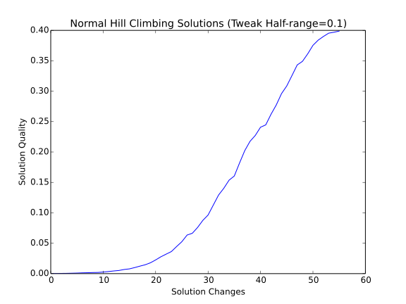
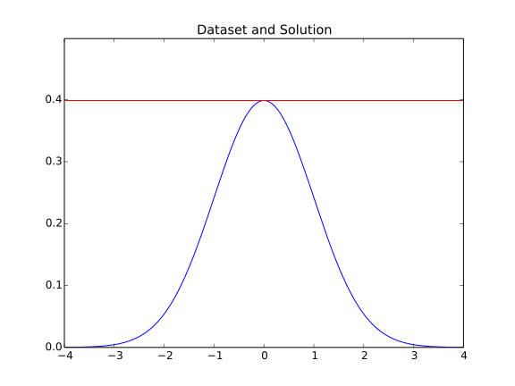

The Steepest Ascent Hill Climber (With Replacement)
===================================================

*Steepest Ascent Hill-Climbing With Replacement* makes the search more aggresive than a regular hill-climber by sampling multiple times around the current candidate solution _[EOM].

.. uml::

   BaseClimber <|-- SteepestAscent

.. currentmodule:: optimization.optimizers.steepestascent
.. autosummary::
   :toctree: api

   SteepestAscent
   SteepestAscent.__call__

The SteepestAscent climber is more aggresive than the hill-climber but still has a problem with local-optima so I'll just test it on the normal-data here.

.. '

.. uml::

   HillClimber o- XYSolution
   HillClimber o- XYTweak
   HillClimber o- UniformConvolution
   HillClimber o- StopConditionIdeal
   HillClimber o- NormalSimulation

.. currentmodule:: optimization.simulations.normalsimulation
.. autosummary::
   :toctree: api

   NormalSimulation
.. currentmodule:: optimization.components.stopcondition 
.. autosummary::
   :toctree: api

   StopConditionIdeal
   
.. currentmodule:: optimization.components.convolutions 
.. autosummary::
   :toctree: api

   UniformConvolution
   
.. currentmodule:: optimization.components.xysolution 
.. autosummary::
   :toctree: api

   XYSolution
   XYTweak

::

    IN_PWEAVE = __name__ == '__builtin__'
    #IN_PWEAVE = True
    def run_climber(climber):
        start = time.time()
        solution = climber()
        end = time.time()
        print "solution: {0}".format(solution)
        print "Ideal: {0}".format(simulator.ideal_solution)
        print "Difference: {0}".format(solution.output - simulator.ideal_solution)
        print "Elapsed: {0}".format(end - start)
        return
    
    if IN_PWEAVE:
        from optimization.simulations.normalsimulation import NormalSimulation
        from optimization.components.stopcondition import StopConditionIdeal
        from optimization.components.convolutions import UniformConvolution, GaussianConvolution
        from optimization.components.xysolution import XYSolution, XYTweak
        import time
        import numpy
        import matplotlib.pyplot as plt
    
        simulator = NormalSimulation(domain_start=-4,
                                     domain_end=4,
                                     steps=1000)
    
        stop = StopConditionIdeal(ideal_value=simulator.ideal_solution,
                                      delta=0.0001,
                                      time_limit=300)
        
        tweak = UniformConvolution(half_range=0.1,
                                   lower_bound=simulator.domain_start,
                                   upper_bound=simulator.domain_end)
    
        xytweak = XYTweak(tweak)
        inputs = numpy.random.uniform(simulator.domain_start,
                                      simulator.domain_end,
                                      size=1)
        candidate = XYSolution(inputs=inputs)
    
        # this is a kludge until I get the call-ordering worked out
        # right now the simulator is setting the .output as a side-effect
        simulator(candidate)
        
        climber = SteepestAscent(solution=candidate,
                                 stop_condition=stop,
                                 tweak=xytweak,
                                 quality=simulator,
                                 local_searches=4)
        run_climber(climber)
    
    def plot_solutions(filename, climber, title):
        output = 'figures/{0}.svg'.format(filename)
        figure = plt.figure()
        axe = figure.gca()
        data = [solution.output for solution in climber.solutions]
        axe.plot(data)
        axe.set_title(title)
        figure.savefig(output)
        print '.. figure:: '  + output
        return
    
    def plot_dataset(filename, climber, simulator, title):
        output = 'figures/{0}.svg'.format(filename)
        figure = plt.figure()
        axe = figure.gca()
        axe.plot(simulator.domain, simulator.range)
        axe.axhline(climber.solution.output, color='r')
        figure.savefig(output)
        print ".. figure:: " + output
        return
    

::

    Inputs: [-0.70676498] Output: 0.310344424928
    Inputs: [-0.61621343] Output: 0.330686117249
    Inputs: [-0.53941553] Output: 0.344717316188
    Inputs: [-0.49130111] Output: 0.353379417987
    Inputs: [-0.41103855] Output: 0.366417995819
    Inputs: [-0.31231803] Output: 0.379475008075
    Inputs: [-0.22884812] Output: 0.388686335818
    Inputs: [-0.16143114] Output: 0.393602615166
    Inputs: [-0.06681276] Output: 0.398019148061
    Inputs: [ 0.01906361] Output: 0.398862340139
    solution: Inputs: [ 0.01906361] Output: 0.398862340139
    Ideal: 0.398939082483
    Difference: -7.67423442817e-05
    Elapsed: 0.00426912307739
    

Now a :ref:`Needle in a Haystack <optimization-simulations-needle-in-haystack>` case.

::

    if IN_PWEAVE:
        # make the target different so we know the data changed
        simulator.reset()
        #simulator.functions = [lambda x: 10 * x + 5]
        simulator.domain_start = -100
        simulator.domain_end = 150
        simulator.domain_step = 0.1
        candidate.output = None
        simulator(candidate)
        climber.solution = candidate
        climber.emit = False
    
        stop._end_time = None
        stop.ideal_value = simulator.ideal_solution
    
        tweak = UniformConvolution(half_range=0.1,
                                   lower_bound=simulator.domain_start,
                                   upper_bound=simulator.domain_end)
    
        xytweak = XYTweak(tweak)
    
        stop.delta = 0.001
    
        climber.tweak = xytweak
        print "Ideal: {0}".format(simulator.ideal_solution)
        run_climber(climber)
    

::

    Ideal: 0.396948572009
    solution: Inputs: [-0.02136199] Output: 0.396948572009
    Ideal: 0.396948572009
    Difference: 0.0
    Elapsed: 0.0036768913269
    

.. figure:: figures/needle_haystack_steepest_ascent.svg

.. figure:: figures/steepest_ascent_needle_haystack_data.svg

Using Gaussian Convolution
--------------------------

The UniformConvolution used as the tweak tends to get stuck in local optima. You can make the half-range larger but then it will have a harder time finding an optima as it approaches randomness. One way to improve the hill-climbers is to sample random values from a normal distribution. Since 68% of the points are within one standard deviation from the mean and 95% are within two standard deviations from the mean, you will tend to get most sampled points centered around the mean (0 for the standard-normal distribution) and only occasionally will you get samples that are far from the mean.

As a comparison, I'll first use a data-set that has local optima. Using the UniformConvolution doesn't always find the solution (because it's stuck at a local optima) so I'm only going to run the gaussian convolution version.

::

    if IN_PWEAVE:
        # change the randomization
        tweak = GaussianConvolution(lower_bound=simulator.domain_start,
                                    upper_bound=simulator.domain_end)
        tweaker = XYTweak(tweak)
        climber.tweak = tweaker
    
        # change the dataset
        simulator.functions = [lambda x: numpy.sin(x), 
                               lambda x: numpy.cos(x)**2]
        simulator._range = None
        candidate.output = None
        simulator(candidate)    
        climber.solution = candidate
        stop.ideal_value = simulator.ideal_solution
        stop._end_time = None
    
        # run the optimization
        run_climber(climber)
    

::

    solution: Inputs: [ 0.39468829] Output: 1.60061650761
    Ideal: 1.60061650761
    Difference: 0.0
    Elapsed: 0.000446081161499
    

.. figure:: figures/gaussian_convolution_steepest_ascent_solutions.svg

.. figure:: figures/gaussian_convolution_steepest_ascent_dataplot.svg

