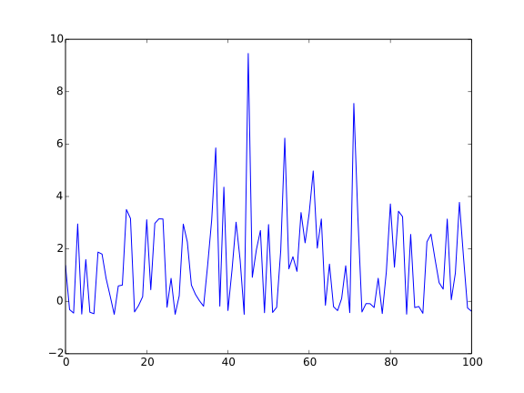
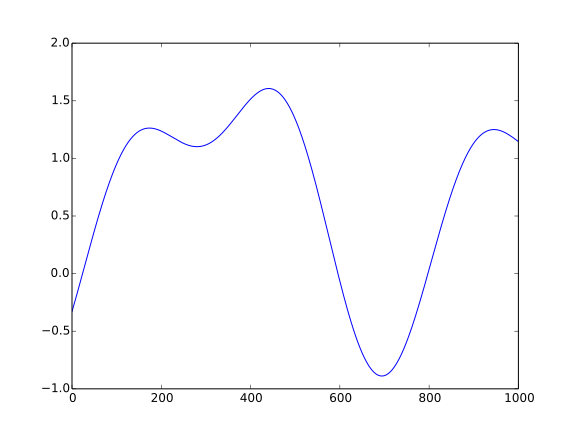

The Normally Distributed Data
=============================

This creates data that is normally distributed.

Contents:

    * :ref:`Normal Simulation Implementation <optimization-simulations-normalsimulation>`
    * :ref:`Normal Data Example <optimization-simulations-normal-data>`
    * :ref:`Needle in a Haystack <optimization-simulations-needle-in-haystack>`
    * :ref:`Normal But Noisy <optimization-simulations-normal-noisy>`

.. _optimization-simulations-normalsimulation:

Normal Simulation Implementation
--------------------------------

.. currentmodule:: scipy.stats.normal
.. autosummary::
   :toctree: api
      
   normal.pdf

.. uml::

   BaseSimulation <|-- NormalSimulation

.. currentmodule:: optimization.simulations.normalsimulation
.. autosummary::
   :toctree: api

   NormalSimulation
   NormalSimulation.ideal_solution
   NormalSimulation.nearest_domain_index
   NormalSimulation.domain
   NormalSimulation.range
   NormalSimulation.__call__

It is just a front-end for `scipy.stats`, and can be used to simulate various unimodal cases.

.. _optimization-simulations-normal-data:

Normal Data Set
---------------

::

    if IN_PWEAVE:
        simulator = NormalSimulation(domain_start=-4, domain_end=4, domain_step
    =0.1)
    
    

.. _optimization-simulations-needle-in-haystack:

Needle In a Haystack
--------------------

To create the needle in a haystack scenario, you can widen the domain to the point that it becomes rare to find the center.

::

    if IN_PWEAVE:
        simulator = NormalSimulation(domain_start=-100, domain_end=150, domain_
    step=0.1)    
    
    

.. _optimization-simulations-normal-noisy:

Normal But Noisy
----------------

The `NormalSimulation` produces a unimodal distribution, to make a noisy distribution, values can be randomly chosen from the distribution and other functions added to the output (which is what we're doing here).

.. '

.. currentmodule:: scipy.stats
.. autosummary::
   :toctree: api

   norm.rvs

.. currentmodule:: optimization.simulations.normalsimulation
.. autosummary::
   :toctree: api

   NoisySimulation

::

    if IN_PWEAVE:
        squared = lambda x: scipy.power(x, 2)
        sine = lambda x: scipy.sin(x)
        noisy = NoisySimulation(domain_start=0, domain_end=100, domain_step=1,
                                functions=[squared, sine])
    
    

Local Optima
------------

The same idea that was used to alter the noisy data can also be used to alter the normal distribution to create something multimodal.

::

    if IN_PWEAVE:
        cosine_squared = lambda x: scipy.cos(x)**2
        sine = lambda x: -scipy.sin(x)
        simulator = NormalSimulation(domain_start=-4,
                                     domain_end=4.1,
                                     domain_step=0.1,
                                     functions=[cosine_squared, sine])
    
    

