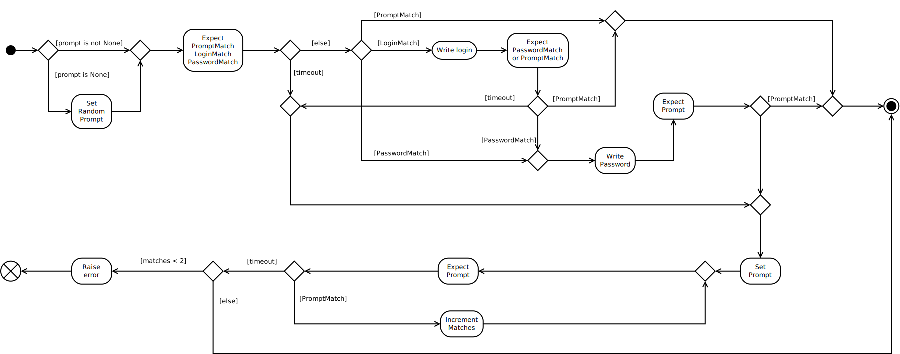

The Telnet Client
=================

The Telnet Client is an adapter that provides an interface that matches the :ref:`SimpleClient <simpleclient>` but using python's Telnet class.

.. '

.. currentmodule:: telnetlib
.. autosummary::
   :toctree: api

   telnetlib.Telnet

Contents:

   * :ref:`Telnet Client <telnet-client>`
   * :ref:`Telnet Output <telnet-client-telnet-output>`
   * :ref:`About the Connect Method <telnet-connect>`

.. _telnet-client:

The TelnetClient Class
----------------------

.. currentmodule:: tuna.clients.telnetclient
.. autosummary::
   :toctree: api

   TelnetClient
   TelnetClient.client
   TelnetClient.exec_command
   TelnetClient.writeline
   TelnetClient.__del__
   TelnetClient.__str__

.. _telnet-client-telnet-output:

The TelnetOutput Class
----------------------

This tries to mimic the stdout objects that the SSHClient returns. It is using `expect` to search for the prompt or end of line so it's important that they both be correct.

.. '

.. autosummary::
   :toctree: api

   TelnetOutput
   TelnetOutput.readline
   TelnetOutput.next
   TelnetOutput.readlines
   TelnetOutput.read
   TelnetOutput.__iter__

.. _telnet-connect:

The Connect
-----------

One of the things that makes the telnet and serial interfaces hard to work with is their lack of a file-like output. The :ref:`TelnetOutput <telnet-client-telnet-output>` tries to get around some of that but ultimately there is a problem in needing to search for the prompt to see if the device is ready for input. Either the user has to set the prompt correctly (and it has to be unique enough that it won't show up in any command's output) or the code has to set it to something it knows. I decided to let the user set it if they want and then to set it to a random string if it isn't set. To do this I'm assuming that the shell support setting the `PS1` environment variable. One wrinkle I ran into was that the shell I use (`fish <http://fishshell.com/>`_) uses functions instead of environment variables. I can't see supporting that, though, so for now only shells that use `PS1` will work with the prompt-mangling. Otherwise the prompt has to be passed in to the TelnetClient before it tries to connect to the server.

.. '

The diagram is probably more complicated than you would normally expect for a telnet connection but I am expecting to use this to work with forwarded serial connections as well, and they tend to be a little... difficult.

