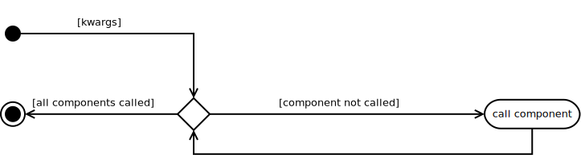

The Composite
=============

.. _the-composite:

.. _composite-class:

The Composite
-------------

The Composite extends the Component by adding a collection to hold other Components and methods to add and remove them.

.. uml::

   BaseComponent <|-- Composite
   Composite : add(Component)
   Composite: remove(Component)
   Composite: <list> components

.. currentmodule:: tuna.components.composite
.. autosummary::
   :toctree: api

   Composite
   Composite.components
   Composite.add
   Composite.remove
   Composite.__call__
   Composite.__iter__
   Composite.__len__
   Composite.__getitem__
   Composite.one_call
   Composite.check_rep
   Composite.close
   Composite.time_remains

The `Composite` was created to be a generalization of the `Hortator`, `Operator` and `Operations`. By specifying the error that it will catch, the error message it will display if there is one, its components, and the component-category of its components, you specify what type of composite it is. It can also act as a regular composite to contain other parts, but this was the original use-case -- to create the infrastructure for the tuna.

 * Each component call is wrapped by the :ref:`try_except decorator <try-except-decorator>` which catches the Exception in self.error

 * The default for ``self.time_remains`` is a :ref:`TimeTracker <tuna-parts-countdown-timetracker>` but can also be a :ref:`CountdownTimer <tuna-parts-countdown-countdowntimer>`

.. note:: The Composite assumes that the components are run as-is and doesn't pass arguments in to them. To change this behavior override the __call__

.. '

.. _simple-composite:

A Simpler Composite
-------------------

The Composite above was meant to be used to create the infrastructure for running tests. Because of this it has many unnecessary things. This Composite is meant to be used by code that is run by the infrastructure. This composite passes all keyword arguments to its components so they all have to be ready to accept them. No positional arguments are passed in as this would require knowing which component takes which argument.

.. uml::

   BaseClass <|-- SimpleComposite
   SimpleComposite o- LeafComponent

.. autosummary::
   :toctree: api

   SimpleComposite
   SimpleComposite.components
   SimpleComposite.add
   SimpleComposite.remove
   SimpleComposite.__contains__
   SimpleComposite.__call__

The Call
~~~~~~~~

The SimpleComposite's call just passes on the kwargs to its components (and logs what it's calling).

.. code-block:: python

    for component in self.components:
        component(**kwargs)

        
Simple Composite Builder
------------------------

A convenience class to build simple composites. Builders are turning out to be light-weight versions of plugins (no help for the user).

.. currentmodule:: tuna.components.composite
.. autosummary::
   :toctree: api

   SimpleCompositeBuilder
   SimpleCompositeBuilder.product

