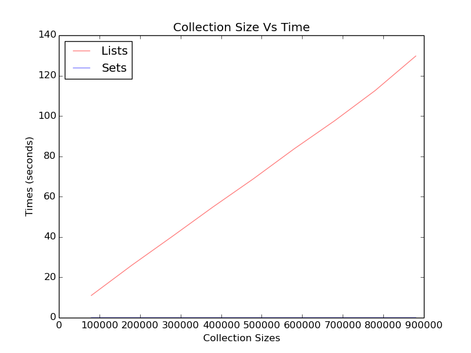

Tabu Experiments
================

The initial way the tabu-list was created was as a list. These are tests to see if that's really the optimal way to do it.

.. '

.. csv-table:: List Times
   :header: Size, Time

   80000.0,11.0363438129
   180000.0,26.0396318436
   280000.0,40.3487291336
   380000.0,54.9013621807
   480000.0,68.9151000977
   580000.0,83.6926100254
   680000.0,97.6503689289
   780000.0,112.64090085
   880000.0,129.725217819

.. csv-table:: Line Regression
   :header: Item, Value
   
   Slope, 0.00015
   Intercept,-0.8
   Std Error,1.1e-06
   R-Squared,1

.. csv-table:: Set Times
   :header: Size, Time

   80000.0,0.00064492225647
   180000.0,0.000654935836792
   280000.0,0.000648975372314
   380000.0,0.000648021697998
   480000.0,0.000658988952637
   580000.0,0.000645875930786
   680000.0,0.000712871551514
   780000.0,0.00066614151001
   880000.0,0.00064492225647

.. csv-table:: Line Regression
   :header: Item, Value
   
   Slope, 2.7e-11
   Intercept,0.00065
   Std Error,2.8e-11
   R-Squared,0.11

Although the list-search is linear, the slope is relatively small because the size of the collections is growing so fast. The set-search is surpringly fast compared to the list-search. It looks to be constant time rather than linear. Although the list-search is relatively fast given the size of the collections (and the fact that I always used the worst case where the last item in the list was what I was looking for), using sets seems a much smarter way to go.
