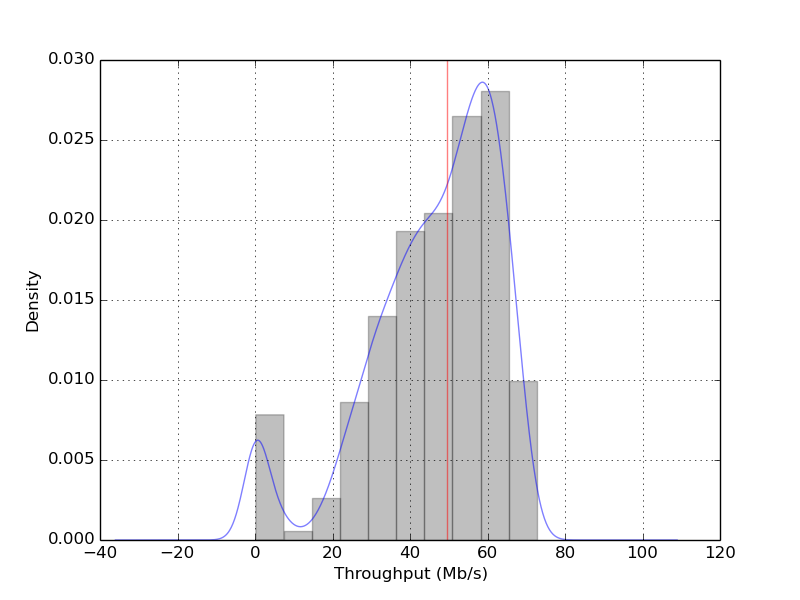

Random Restarts With Simulated Table Data
=========================================

.. _case-study-random-restarts-table:

Problem
-------

How can we understand how the :ref:`Hill Climbing with Random Restarts <hill-climbing-random-restarts>` parameters should be set while trying to optimize device placement on a table and how does it perform relative to the :ref:`Simulated Annealing <tuna-optimizers-simulatedannealing-background>` optimizer?

As with the :ref:`Simulated Annealing Case Study <case-study-annealing-simulated-table>`,  we'll use data collected by exhaustively sweeping a table and pass this data to the optimizer to see how it performs. Since we did an exhaustive sweep we know what the best and worst cases and we can see how many times the optimizer has to lookup a value to see how good a candidate is before reaching a solution. The count of lookups can then be compared with a `real` iperf session or by estimating the number of seconds each lookup would take.
.. '

The Simulation Data
-------------------

This is a duplication of what is in the :ref:`Simulated Annealing Case Study <case-study-annealing-simulated-table>` so if you have already seen it you can jump down to the explanation of :ref:`how the Random-Restarts works <case-study-random-restarts-pseudocode>`.

Alex created the data-set (:download:`download <../data/data_step50.csv>`) by stepping through the table coordinates (with a step-size of 50) while the table was inside a Faraday cage and measuring throughput using iperf. The table I'm referring to is a two-axis table that Cameron created for another project but wasn't using (a version of the control code that I modified to run in the tuna is somewhat documented `here <http://rallion.bitbucket.org/others/xytable/index.html>`_).

The data-file is a csv with the row-indices assumed to be the y-values and the column-indices assumed to the be the x-values (both scaled by the step-size of 50 so row 1 (using a zero-based index) maps to y=50 on the physical table). The values in the data are the iperf bandwidth measurements for the location on the table (the traffic was run downstream for 5 seconds with the TCP window set to 256 K).

Data Plots
~~~~~~~~~~

.. figure:: figures/data_profile.png
   :scale: 75%

   *Side View* (0,0) is at rear-left, (3000,3000) at front right, z-axis is Mbits/second.

.. figure:: figures/data_angled.png
   :scale: 75%

.. figure:: figures/contoured.png
   :scale: 75%

   Max-throughput (72.7 Mb/s) at (350, 2550) indicated by intersection of red lines. Min-throughput (0.22 Mb/s) at (1200, 2950) indicated by intersection of blue lines.

The contour map gives a somewhat more informative view (a birds-eye view looking down on the table with the higher throughputs indicated by warmer colors and lower throughput indicated by cooler colors).
 
.. figure:: figures/best_worst_scatter.png
   :scale: 75%

   Best and worst throughput locations. Black indicates < 10 Mbits/second. Red indicates > 70 Mbits/second.
   Intersection of red lines indicate best overall location. Intersection of blue lines indicate worst location.

The best points appear to have a clear bias toward the left side, and the worst points do appear to be a little denser to the right, but for the most part the worst points appear to be nearly randomly scattered around the table.

Summary Statistics
~~~~~~~~~~~~~~~~~~

.. csv-table:: Summary Table
   :header: Statistic, Value

   count,3721
   mean,46.0563
   std,16.8165
   min,0.22
   25%,36.8
   50%,49.5
   75%,59
   max,72.7

.. figure:: figures/box_plot.png
     :scale: 75%

We can see from the box-plot that the data is fairly spread out and left-skewed.

Looking at the distribution we can see there are two (possibly 3) sub-distributions with a significant amount of data under 10 Mbits/second.

.. figure:: figures/data_cdf.png
  :scale: 75%

Looking at the left-hand side of the CDF we can see that there's a jump of about 5% very near 0 Mbits/Second and it stays relatively flat until around 20 Mbits/Second so that initial bump in the KDE/Histogram is for data points that are very near 0. We can check the proportion of points that are less than 1 Mbits/second to see.

.. '

::

    total = float(len(flat_data))
    less_than_one = flat_data[flat_data < 1]
    one_to_twenty = flat_data[(flat_data >=1) & (flat_data < 20)]
    
    

**Less than 1 Mbits/Second:** 0.0468

**From 1 to less than 20 Mbits/Second:** 0.0247

So about 5% of the data is less than 1 Mbits/second, contributing most of the data points from 0-20 Mbits/second.

.. csv-table:: Binned Fractions
   :header: Values, Count, Fraction of Total

   0-9,219,0.059
   10-19,47,0.013
   20-29,297,0.080
   30-39,585,0.157
   40-49,745,0.200
   50-59,1006,0.270
   60-69,792,0.213
   >= 70,30,0.008

If the whole table is searched you would have about a 50-50 chance of getting a value greater than 50 Mbits/second just by randomly picking a location, but less than 1% chance of getting throughput greater than 70 Mbits/Second and a 5% chance of getting less than 1 Mbits/second. Looking at the plot of just the best and worst points above you can see that the best points disappear just before the half way point (from left to right). If we somehow knew in advance that this was always true, we could limit the search to just the left half of the table and improve the chances of finding a location with better values.

The Neighborhood
~~~~~~~~~~~~~~~~

These are the points surrounding the minimum and maximum values for the entire data set. First the neighborhood around the maximum value.

Maximum Neighborhood
++++++++++++++++++++

.. figure:: ../figures/bad_neighborhood.svg

   The neighborhood around the best-bandwidth location.

The arrows represent a path that a hill climber using a local search might take. The three blue circles are local optima that prevent their neighbors from reaching the global optima (the blue rectangle). Of the sixteen nodes making up the outer ring, eleven fail to reach the global optima and five are able to find it. All of the five successful cases approach the global optima from the top right of the neighborhood. I'm assuming that the nodes in the outer ring are themselves all reachable but that might not be the case if we looked at the nodes surrounding them.

.. '

Minimum Neighborhood
++++++++++++++++++++

.. figure:: ../figures/worst_neighborhood.svg

   The neighborhood around the worst-bandwidth location.

In the case of the worst data point (in the blue rectangle), it occurred near the edge of the table so I left the right most column empty to keep it centered in the figure. Just below the lowest point is another local optima which would trap a hill-climber. The minimum doesn't appear to have any real relationship to the data-points around them. It would be interesting to find out why the dead-spots occur.

.. '

.. _case-study-random-restarts-pseudocode:

Pseudocode for Random Restarts
------------------------------

To get an idea of the parameters that need to be adjusted it might be helpful to understand the basic operation. As you can probably guess by the name, the Hill-Climbing with Random Restarts optimizer is a hill-climber that does a stochastic local search to find the optima but every once in a while jumps to a random location and starts over so that it doesn't get trapped in a local optimum. Because it's using GaussianConvolution (in this case) this actually kind of happens anyway, but when the local search times are short enough it can be more aggressive about jumping around.

.. figure:: figures/random_restarts_pseudocode.svg

   Pseudocode for the random restart hill-climbing. *T* is a random (uniform) distribution of local-search times.

The meta-heuristic is primarily comprised of two loops. The outer loop generates random candidate solutions (table-positions in this case) and then runs the inner loop. The inner-loop searches locally until it times out or happens to find the ideal solution. 

Gaussian Convolution
--------------------

The `Tweak` in this case is :ref:`Gaussian Convolution <optimization-tweaks-gaussian>`.

Sample Configuration File
-------------------------

This is a sample configuration file for running this test (and was used to collect the data used later in this document). The main parameters of interest are in the `[RandomRestarts]` section.

.. literalinclude:: data/random_restarts_full_table.ini
   :language: ini

In this case each local search will run for some random time from 1 to 10 seconds (because this is simulated data not a real trial) and each of the overall tests will be limited to 10 Minutes, with the simulation run 1,000 times (in the worst case this would take a week to finish so I'm hoping it will do well enough to quit early when it finds a good-enough solution.

.. '

TUNA Section
~~~~~~~~~~~~

The ``[TUNA]`` section is a place to list what the plugin sections will be. In this case we're telling the `tuna` that there will only be one plugin and the information to configure it will be in a section named ``[RandomRestarts]``.

.. '

DEFAULT Section
~~~~~~~~~~~~~~~

We're going to repeat the simulation 1,000 times and store the data in a folder named `random_restarts_full_table_scale_1` next to the configuration file.
..'

MODULES Section
~~~~~~~~~~~~~~~

We're simulating the use of Cameron's XYTable so we need to tell the `tuna` which module contains the plugin to fake the table's operation. This isn't needed for the simulation but provides a way to check and see that the `tuna` is calling it the way we expect. The listed module will be imported so the ``xytable`` package has to have been installed for this to work.

RandomRestarts Section
~~~~~~~~~~~~~~~~~~~~~~

The ``plugin = RandomRestarts`` line tells the tuna to load the `RandomRestarts` class. 

The ``components = fake_table, table_data`` line tells the tuna to create components using the `fake_table` and `table_data` section in this configuration files and give it to the RandomRestarts optimizer (wrapped in a :ref:`composite <simple-composite>`). The components will be used to decide how good a location is (they make up the `Quality` function calls shown in the pseudocode). We're substituting mocks for a table control object (fake_table) and an iperf object (table_data). `fake_table` will log the calls made to it so we can check that the program is running like we think it should. The `table_data` object will lookup the data that Alex recorded using the table-coordinates it was given and give it back to the optimizer.

The ``observers = fake_table`` line tells the `tuna` to give the optimizer a copy of the table-mock so that it will call it once it stops. This simulates moving the table to the best solution found at the end of an optimization run.

The ``location`` and ``scale`` for the  ``GaussianConvolution`` sets :math:`\mu` and :math:`\sigma` values for the random distribution that the optimizer samples from to generate new candidate solutions to explore. ``number_type = integer`` tells it to cast the values to integers (so that the x,y coordinates will be whole numbers not fractions). The data-set is represented as a :math:`61 \times 61` table so the ``lower_bound`` and ``upper_bound`` represent the indices for the table.

.. '

The Outcome
-----------

How many times did it find the maximum-bandwidth location?
~~~~~~~~~~~~~~~~~~~~~~~~~~~~~~~~~~~~~~~~~~~~~~~~~~~~~~~~~~

Using the log file (`tuna.log`) we can see how the operations went. The file itself is large (over a gigabyte) so I'm going to document what I did but not include the data itself.

.. '

The first order of business was getting the data into a single file. Because I had run the `tuna` before there was old logging in the files that needed to be ignored and since I had put a limit of 1 gigabyte on the files the logger broke the output into two files ('tuna.log' and the older 'tuna.log.1').

The first line of the new data contained this string::

    2014-08-04 18:43:13

.. highlight:: python

So I created a new single file using python::

    with open('tuna_re.log','w') as w:
        lines = open('tuna.log.1')
    for line in lines:
        if '2014-08-04 18:43:14' in line:
            w.write(line)
            break
    for line in lines:
        w.write(line)
    for line in open('tuna.log'):
        w.write(line)
                        
To make sure that it ran 1,000 times I grepped how many times the solution the Restarter found was passed to the XYTable::

    grep "RandomRestarter giving solution to" tuna_re.log | wc -l

Which confirmed that it was run 1,000 times.

When the `tuna` finds the ideal value (or it exceeds the time limit we set) it outputs "Stop condition reached" along with the coordinates and bandwidth found, which look like this example::

   Stop condition reached with solution: Inputs: [  7.  51.] Output: 72.7

To get the number of cases where 72.7 Mbits/second was found:

.. code-block:: bash

   grep "Stop.*Output:[[:space:]]*72\.7" tuna_re.log  | wc -l

This gives us 801 so it found it 80% of the time, compared to 30% for the Simulated Annealer.

How many times did it do well enough?
~~~~~~~~~~~~~~~~~~~~~~~~~~~~~~~~~~~~~

Picking an arbitrary value of 70 Mbits/second as the lower bound of an acceptable bandwidth, how often did the optimizer exceed this lower bound?

.. code-block:: bash

   grep "Quality.*Output:[[:space:]]*7[[:digit:]]" tuna_re.log  | wc -l

Gave an output of 1,000. I had to use the sub-string "Quality Checks" instead of "Stop Condition" because for some reason the message only got printed when the ideal solution was found. I think I didn't set a delta so the cases where it timed-out before it reached 72.7 didn't create this message (but I have to look into this).

How well did it typically do?
~~~~~~~~~~~~~~~~~~~~~~~~~~~~~

By diverting the output from the previous `grep` search to a file instead of piping it to `wc`, I was able to get the final bandwidths the `tuna` reached (it's included in the "Quality Checks" line as "Output:")::

   Quality Checks: 1486 Solution: Inputs: [  7.  51.] Output: 72.7

.. '

.. highlight:: python

I then extracted the (:download:`bandwidths <data/solution_bandwidths.csv>`)into another file::

    with open('solutions_bandwidths.csv', 'w') as w:
        w.write("Bandwidth\n")
        for line in open("full_table_solutions_bandwidths.log"):
            w.write("{0}\n".format(line.rsplit(" ", 2)[-2 ]))))

The lines have invisible formatting characters at the end of them so the bandwidth ended up being the second sub-string from the right even though the log output looks like it should be the last sub-string.

Now we can get some summary statistics using Pandas.

::

    bandwidths = pandas.read_csv('data/solutions_bandwidths.csv')
    description = bandwidths.Bandwidth.describe()
    
    

.. csv-table:: Bandwidth Solutions Summary
   :header: Statistic, Value

   count,1000.00
   mean,72.55
   std,0.31
   min,70.60
   25%,72.70
   50%,72.70
   75%,72.70
   max,72.70

.. figure:: figures/bandwidths_kde.png
   :scale: 75%

So in the worst case it did 70.6 compared to 70.3 Mbits/second for the SimulatedAnnealing, which might prove sufficient. To get an idea of a reasonable range for the `mean` bandwidth I'll use a 99% confidence interval with resampling.

.. '

::

    trials = 10**5
    n = len(bandwidths)
    output = 'data/random_restarts_full_table_confidence.pkl'
    if not os.path.isfile(output):
        samples = numpy.random.choice(bandwidths.Bandwidth,
                                      size=(n, trials))
        #numpy.savez(output, samples=samples)
        means = samples.mean(axis=0)
        alpha = 0.01
        p = alpha/2
    
        low = numpy.percentile(means, p)
        high = numpy.percentile(means, 1-p)
        interval = pandas.Series([low, high], index='low high'.split())
        interval.to_pickle(output)
    else:
        #samples = numpy.load(output)['samples']
        interval = pandas.read_pickle(output)
    
    

**99% Confidence Interval:** (72.510, 72.527)

So 99% of the time we would expect the mean bandwidth to be between 72.51 Mbits/second and 72.53 Mbits/second.

How long were the execution times?
~~~~~~~~~~~~~~~~~~~~~~~~~~~~~~~~~~

.. highlight:: bash

To get an estimate of the times I'm going to use the "*** Starting hillclimber ***" sub-string to indicate the start of every trial and the "'setPosition' attribute called on railA" sub-string to indicate the number of times that the table was told to move. First those lines were extracted::

    grep "Starting hillclimber\|railA > rail_calls.log"

.. '

.. highlight:: python
    
This file is too large to include here, but I created a :download:`csv-file <data/table_calls.csv>` with the count of the table-calls per-trial::

    table_calls = 0
    with open('table_calls.csv', 'w') as w:
        w.write("RailCalls\n")
        for line in open('rail_calls.log'):
            if 'Starting' in line and table_calls !=0:
                w.write("{0}\n".format(table_calls))
                table_calls = 0
                continue
            if "railA" in line:
                table_calls += 1
        w.write("{0}\n".format(table_calls))

This will over-estimate the time because the last call in each trial tells the table to move to the solution that was found without running iperf. So it has to be adjusted by the assumed iperf run-time of 10 seconds per trial (with a total of 1,000 trials).

::

    calls = pandas.read_csv('data/table_calls.csv')
    
    

.. csv-table:: Table Call Counts Summary
   :header: Statistic, Value

   count,1000.000
   mean,1568.724
   std,855.189
   min,87.000
   25%,837.750
   50%,1612.000
   75%,2288.000
   max,3395.000

To convert it to a time-per trial I'll use:

.. math::

   time \gets (iperf + move) \times count - iperf

Where 15 is the assumed run-time per check (iperf + move) in seconds and the last iperf session is subtracted out to reflect the final move of the table to the best solution found. This gives seconds so I'll also divide it by 3600 to convert it to hours.

::

    calls['times'] = (15 * calls.RailCalls - 10)/3600.
    
    

.. csv-table:: Execution Times Summary
   :header: Statistic, Value

   count,1000.000
   mean,6.534
   std,3.563
   min,0.360
   25%,3.488
   50%,6.714
   75%,9.531
   max,14.143

This seems to indicate that the Random Restarts did worse than the Simulated Annealer (which had an estimated min of 0.28, median of 4.2, and max of 5.7). Before concluding this, however, it might be useful to ask when did it first reach the 70 Mbits/Second mark? If this we decide this is good enough, does it make a difference?

.. highlight:: bash

First we need the "Starting" lines that indicate the start of a trial and the "New best solution" lines that have at least 70 Mbits/second of output::

   grep "Starting hillclimber\|New.*Output:[[:space:]]*7[[:digit:]]" tuna_re.log > good_enough.log

.. highlight:: python
   
Now we need to save the first line in each trial.

.. literalinclude:: code/good_enough.py

::

    output = 'data/good_enough.csv'
    good_enough_data = pandas.read_csv(output)
    
    

.. csv-table:: Good Enough Counts and Times
   :header: Statistic, Count, Time, Bandwidth

   count,1000.000,1000.000,1000.000
   mean,259.218,1.080,70.834
   std,162.736,0.678,0.678
   min,59.000,0.246,70.000
   25%,133.000,0.554,70.400
   50%,212.000,0.883,70.500
   75%,334.250,1.393,71.200
   max,1098.000,4.575,72.700

