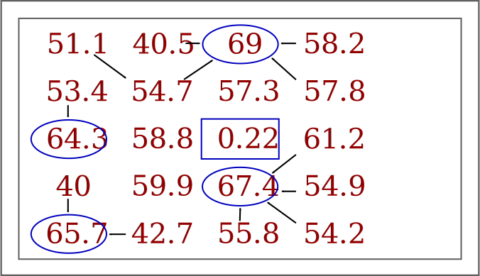
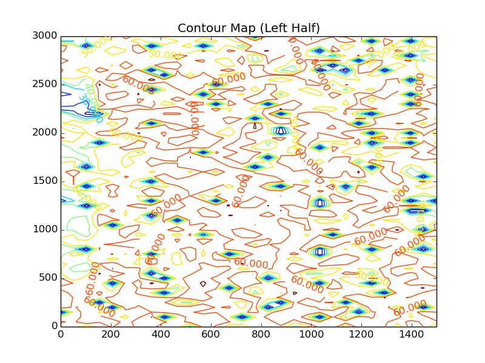

Simulated Annealing With Simulated Table Data
=============================================

Problem
-------

*How can we understand how the `Simulated Annealing` parameters should be set while trying to optimize device placement on a table?*

In order to make the optimization work we need to know how to set the parameters that affect whether the optimizer will emphasize *exploration* or *exploitation* (will it jump around a lot or will it stick to looking around where it is?). We also need to know a reasonable stopping condition -- setting an ideal value would allow a short-circuit to end the optimization but runs the risk that we've chosen an incorrect ideal value, while setting a time-out runs the risk of either being too short and missing the optimal value or being too long and searching needlessly while delaying moving on to the next phase of the experiment.

.. '

What we'll do here is use data collected by exhaustively sweeping a table and passing it to the optimizer to see how it performs. Since we did an exhaustive sweep we know what the best and worst cases are so we can see how many times the optimizer has to lookup a value to see how good a candidate is. The count of lookups can then be compared with a `real` iperf session or by estimating the number of seconds each lookup would take. The second option isn't as straight-forward as it may seem because the candidates store their solutions once they are given so a candidate may be asked for its solution multiple times but there would only be one real check (meaning one iperf session run) and the remainder of the times the solution would be retrieved from memory.

The Simulation Data
-------------------

Alex created the data-set (:download:`download <data/data_step50.csv>`) by stepping through the table coordinates (with a step-size of 50) while the table was inside one a Faraday cage and measuring throughput using iperf. I don't know what the scale is in human terms but the annealer doesn't need to know. The file is a csv with the row-indices assumed to be the y-values and the column-indices assumed to the be the x-values (both scaled by the step-size of 50). The values are the iperf bandwidth measurements for the location on the table (the traffic was run downstream for 5 seconds with the TCP window set to 256 K).

I'll examine the data so we can see what the Simulated Annealer is working with.

.. '

Data Plots
~~~~~~~~~~

.. figure:: figures/data_profile.png
   :scale: 75%

   *Side View* (0,0) is at rear-left, (3000,3000) at front right, z-axis is Mbits/second.

I don't know how the grid corresponds to actual locations of things so I'm assuming that the origin marks the front-left of the table (whatever 'front' means). It looks like the front of the table gets better throughput than the back.

.. figure:: figures/data_angled.png
   :scale: 75%

.. figure:: figures/contoured.png
   :scale: 75%

   Max-throughput (72.7 Mb/s) at (350, 2550) indicated by intersection of red lines. Min-throughput (0.22 Mb/s) at (1200, 2950) indicated by intersection of blue lines.

The contour map gives a somewhat more informative view. You can see that one side of the table tends to get more of the good throughput (which I think Bryce and Brent indicated).
 
.. figure:: figures/best_worst_scatter.png
   :scale: 75%

   Best and worst throughput locations. Black indicates < 10 Mbits/second. Red indicates > 70 Mbits/second.
   Intersection of red lines indicate best overall location. Intersection of blue lines indicate worst location.

The best points appear to have a clear bias toward the left side, and the worst points do appear to be a little denser to the right, but for the most part the worst points appear to be nearly randomly scattered around the table.

Summary Statistics
~~~~~~~~~~~~~~~~~~

.. csv-table:: Summary Table
   :header: Statistic, Value

   count,3721
   mean,46.0563
   std,16.8165
   min,0.22
   25%,36.8
   50%,49.5
   75%,59
   max,72.7

.. figure:: figures/box_plot.png
     :scale: 75%

We can see from the box-plot that the data is fairly spread out and left-skewed.

.. figure:: figures/data_kde.png
   :scale: 75%

Looking at the distribution we can see there are two (possibly 3) sub-distributions with a significant amount of data under 10 Mbits/second.

.. figure:: figures/data_cdf.png
  :scale: 75%

Looking at the left-hand side of the CDF we can see that there's a jump of about 5% very near 0 Mbits/Second so that initial bump in the KDE/Histogram is for data points that are very near 0. We can check the proportion of points that are less than 1 Mbits/second to see.

.. '

::

    total = float(len(flat_data))
    less_than_one = flat_data[flat_data < 1]
    
    

**Less than 1 Mbits/Second:** 0.0468

So about 5% of the data is less than 1 Mbits/second.

.. csv-table:: Binned Fractions
   :header: Values, Count, Fraction of Total

   0-9,219,0.059
   10-19,47,0.013
   20-29,297,0.080
   30-39,585,0.157
   40-49,745,0.200
   50-59,1006,0.270
   60-69,792,0.213
   >= 70,30,0.008

If the whole table is searched you would have about a 50-50 chance of getting a value greater than 50 Mbits/second just by randomly picking a location, but less than 1% chance of getting throughput greater than 70 Mbits/Second and a 5% chance of getting less than 1 Mbits/second. Looking at the plot of just the best and worst points above you can see that the best points disappear just before the half way point (from left to right). If we somehow knew in advance that this was always true, we could limit the search to just the left half of the table and improve the chances of finding a location with better values.

The Neighborhood
~~~~~~~~~~~~~~~~

These are the points surrounding the minimum and maximum values for the entire data set. First the neighborhood around the maximum value.

.. figure:: figures/bad_neighborhood.svg

I'm using index slicing so the arrays are arranged backwards and upside down -- the values on the right of the neighborhood diagram are on the top in the contour and scatter plots. 

The arrows represent a path that a hill climber using a local search might take. The three blue circles are local optima that prevent their neighbors from reaching the global optima (the blue rectangle). Of the sixteen nodes making up the outer ring, eleven fail to reach the global optima and 5 are able to find it. All five approach the global optima from the top right. I'm assuming that the nodes in the outer ring are themselves all reachable but that might not be the case if the entire grid was used.

In the case of the worst data point (in the blue rectangle), it occurred near the edge of the table so I left the right most column empty. Just below the lowest point is another local optima which would trap a hill-climber. The minimum doesn't appear to have any real relationship to the data-points around them. It would be interesting to find out why the dead-spots occur.

While working on the diagram it occurred to me that if a hill-climber only looks at its nearest neighbors (one cell away) then the dead-spots would generally not be picked as a next step, since they don't appear to be clustered and the climber would always pick the adjacent neighbor with the higher value. This means that there would be cells on the table that the climber might never see if they happened to be surrounded by a buffer of lower-valued cells. This wouldn't be the case for Simulated Annealing, which occasionally picks the solution that is worse than the current solution (and doesn't do a local search anyway).

Partitioning the Data
~~~~~~~~~~~~~~~~~~~~~

If we know that the data will always look like the set we have, we can reduce our search space to just the left half of the table. Here I'll see how that affects the probability of finding the best value.

.. '

.. figure:: figures/sub_scatter.png
   :scale: 75%

   Best and worst throughput locations. Red indicates < 10 Mbits/second. Black indicates > 70 Mbits/second.

.. csv-table:: Binned Fractions (Left Half)
   :header: Values, Count, Fraction of Total

   0-9,89,0.049
   10-19,7,0.004
   20-29,20,0.011
   30-39,72,0.039
   40-49,236,0.129
   50-59,687,0.375
   60-69,689,0.377
   >= 70,30,0.016

If only the left-half of the table were searched then you would have about a 77% chance of getting 50 Mbits/second or higher, but the chance of getting greater than 70 Mbits/second remains low at around 2%. The fraction of data points less than 10 Mbits/second goes down only 1% (from 0.059 to 0.049).

Pseudocode for Simulated Annealing
----------------------------------

To get an idea of the parameters that need to be adjusted it might be helpful to understand the basic simulated annealing operation.

   1. Get a candidate solution
   2. Make the current solution and the best solution the candidate solution
   3. While time remains and the best solution is not the ideal solution repeat:

      3.1. Get a new candidate by tweaking the current solution

      3.2. If new candidate is better than current solution or a random number is less than the annealing value, make the current solution the new candidate

      3.3. If the current solution is better than the best solution, make the current solution the best solution

   4. Return the best solution

The two points that we need to look at are 3.1. (get a new candidate by tweaking the current solution) and 3.2. (... a random number is less than the annealing value).

Simulated Annealing
-------------------

First let's look at `3.2. (a random number is less than the annealing value)`.

The :ref:`SimulatedAnnealing <optimization-optimizers-simulatedannealing-background>` documentation has more detail of how it works but the main thing to note here is that we determine how it behaves by setting an initial temperature (:math:`T_0`) and a constant :math:`\alpha` such that :math:`T(t)`, the temperature at time `t`, is defined by the function:

.. math::

   T(t) = T_0 \alpha^t\\

And since time is assumed to be positive, this means that :math:`\alpha` has to be less than one if we want the temperature to drop (cool) with time. The temperature is used to decide whether a candidate solution that is worse than the current solution is accepted as a new solution. The higher the initial temperature, the more likely this is to happen and so the more the optimizer will explore, rather than accept a local optima. If :math:`\alpha` is closer to 0 or the initial temperature is low, then the optimizer will tend to choose one of the first local optima it finds. The actual choice of parameters has to be determined by the data. 

Gaussian Convolution
--------------------

Now we can look at `3.1. (get a new candidate by tweaking the current solution)`. 

In this case the new candidate is found by selecting values from a Normal distribution and adding them to the current solution. Since we are using a Normal distribution we know that about 68% of the values we pick will be within one standard deviation of the mean, 95% of the values will be within two standard deviations from the mean, and 99.7% of the data will be within three standard deviations from the mean. So by picking the mean (:math:`\mu`) and standard deviation (:math:`\sigma`) for our distribution, we can determine how far each new candidate is most likely to be from the previous solution, but not exactly how far (sometimes, although rarely, the chosen value will be more than three standard deviations from the mean).

Once again the :ref:`actual implementation <optimization-tweaks-gaussian>` has more information.

Sample Configuration File
-------------------------

This is a sample configuration file for running this test. The parameters of interest are for the annealing and the convolution. Note that I set a :math:`T_{final}` but in practice the time-out gets hit before this is actually reached.

.. csv-table:: Simulated Annealing Parameters
   :header: Variable,Configuration Option, Value

   :math:`T_0`, ``start_temperature``, :math:`10^{5}`
   :math:`T_{final}`, ``stop_temperature``, `0.01`
   :math:`\alpha`, ``alpha_temperature``, 0.99
   
.. csv-table:: Gaussian Convolution Parameters
   :header: Variable,Configuration Option, Value

   :math:`\mu`, ``location``, 0 
   :math:`\sigma`, ``scale``, 1

.. literalinclude:: data/simulated_annealing_exhaustive.ini
   :language: ini

TUNA Section
~~~~~~~~~~~~

The ``[TUNA]`` section is a place to list what the plugin sections will be. In this case we're telling the `tuna` that there will only be one plugin and the information to configure it will be in a section named ``[Annealing]``.

DEFAULT Section
~~~~~~~~~~~~~~~

We're going to repeat the simulation 1,000 times and store the data in a folder named `annealing_tabledata_t0_10000_scale_2` next to the configuration file.

MODULES Section
~~~~~~~~~~~~~~~

In this case we're simulating the use of Cameron's XYTable so we need to tell the `tuna` which module contains the plugin to fake the table's operation. This isn't really needed for the simulation but provides a way to check and see that the `tuna` is calling it the way we expect. The listed module will be imported so the ``xytable`` package has to have been installed for this to work.

Annealing Section
~~~~~~~~~~~~~~~~~

The ``plugin = SimulatedAnnealing`` line tells the tuna to load the `SimulatedAnnealing` class. 

The ``components = fake_table, table_data`` line tells the tuna to create components using the `fake_table` and `table_data` section in this configuration and give it to the Simulated Annealer. The components will be used to decide how good a location is. In this case we're substituting mocks for a table control object (fake_table) and an iperf object (table_data). `fake_table` will just log the calls made to it so we can check that the program is running like we think it should. The `table_data` object will lookup the data that Alex recorded using the table-coordinates it was given and give it back to the Simulated Annealer.

The ``observers = fake_table`` line tells the `tuna` to give the `Simulated Annealer` a copy of the table-mock so that it will call it once it stops. This simulates moving the table to the best solution found at the end of an optimization run.

The temperature related settings were explained above.

The ``candidate = 20, 20`` tells the ``tuna`` to tell the Simulated Annealer to start its searching at x=20, y=20. I'm going to add a better random-candidate chooser, but for now if the initial candidate isn't passed in it ends up at 0,0 most of the time which it turns out makes the Annealer perform better just by luck, so I'm setting it to 20,20 to make the search a little harder.

The ``location`` and ``scale`` for the  ``GaussianConvolution`` were discussed previously. ``number_type = integer`` tells it to cast the values to integers (so that the x,y coordinates will be whole numbers not fractions). The data-set is represented as a :math:`61 \times 61` table so the ``lower_bound`` and ``upper_bound`` represent the indices for the table. The ``GaussianConvolution`` expects a square table but after looking at the data I realized that the search might perform better if only the left-half of the table was used. You could just halve the ``upper_bound`` parameter, but that would quarter the range of the table search, not halve it, so I created another class, the :ref:`XYConvolution <tuna.tweaks.convolutions>` that acts like the `Gaussian Convolution` but takes separate bounds for the x and y axes. Since this just adds more parameters I'm using the Gaussian Convolution to test the simulation under the assumption that we won't be able to halve the search space in most cases.

.. '

The Outcome
-----------

How many times did it find the maximum-bandwidth location?
~~~~~~~~~~~~~~~~~~~~~~~~~~~~~~~~~~~~~~~~~~~~~~~~~~~~~~~~~~

Using the log file (`tuna.log`) we can see how the operations went. The file itself is large so I'm going to document what I did but not include the data itself. 

To get a count of the number of times the test was run I counted the occurences of the string "Initial Candidate":

.. '

.. code-block:: bash

   grep "Initial" tuna.log | wc -l

This showed that it was run 100 time. When the `tuna` finds the ideal value (or it exceeds the time limit we set) it outputs "Stop condition reached" along with the coordinates and bandwidth found. To get the number of cases where 72.7 Mbits/second was found:

.. code-block:: bash

   grep "Stop.*Output:[[:space:]]*72\.7" tuna.log  | wc -l

This gives us 30 so it found it 30% of the time. 

How many times did it do well enough?
~~~~~~~~~~~~~~~~~~~~~~~~~~~~~~~~~~~~~

Since we set a threshold level the tuna sometimes gave up once it got to 70 Mbits/second, so how many times did it hit this threshold?

.. code-block:: bash

   grep "Quality.*Output:[[:space:]]*7[[:digit:]]" tuna.log  | wc -l

Gave an output of 100. I had to use the sub-string "Quality Checks" instead of "Stop Condition" because for some reason there was one case where the temperature dropped low enough to quit without triggering the stop-condition. Anyway, it looks like in all cases the `tuna` found a solution that gave at least 70 Mbits/second.

How well did it do?
~~~~~~~~~~~~~~~~~~~

By diverting the output from the previous `grep` search instead of piping it to `wc`, I was able to get the final bandwidths the `tuna` reached (it's included in the "Quality Checks" line as "Output:").

.. '

::

    bandwidths = pandas.read_csv('data/solution_bandwidths.csv')
    description = bandwidths.Bandwidth.describe()
    
    

.. csv-table:: Bandwidth Solutions Summary
   :header: Statistic, Value

   count,100.0
   mean,72.082
   std,0.493058891727
   min,70.3
   25%,72.0
   50%,72.0
   75%,72.7
   max,72.7

.. figure:: figures/bandwidths_kde.png
   :scale: 75%

::

    trials = 10**5
    n = len(bandwidths)
    samples = numpy.random.choice(bandwidths.Bandwidth,
                                  size=(n, trials))
    means = samples.mean(axis=0)
    alpha = 0.05
    p = alpha/2
    
    low = numpy.percentile(means, p)
    high = numpy.percentile(means, 1-p)
    
    

**95% Confidence Interval:** (71.907, 71.965)

