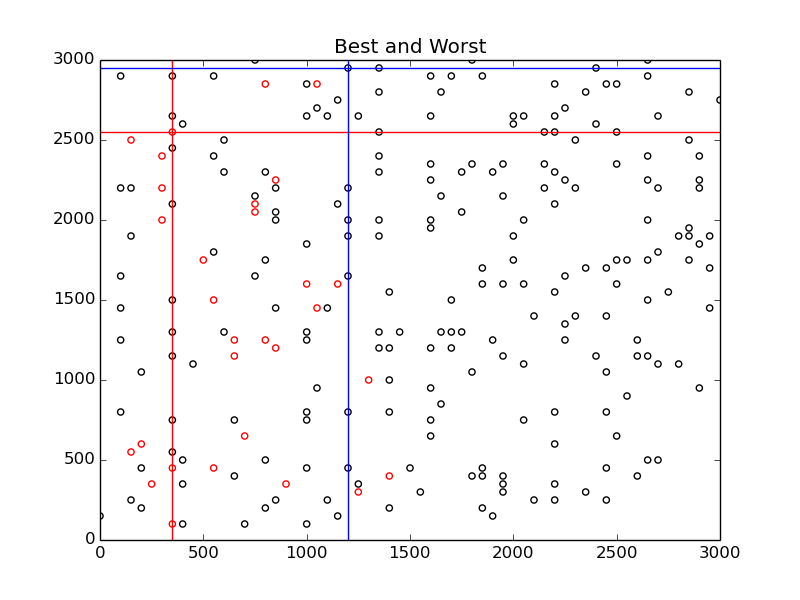
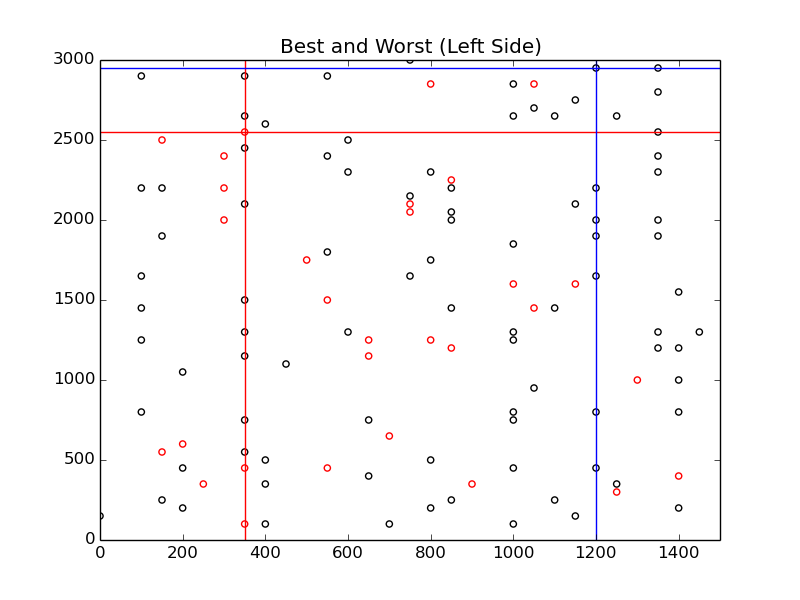
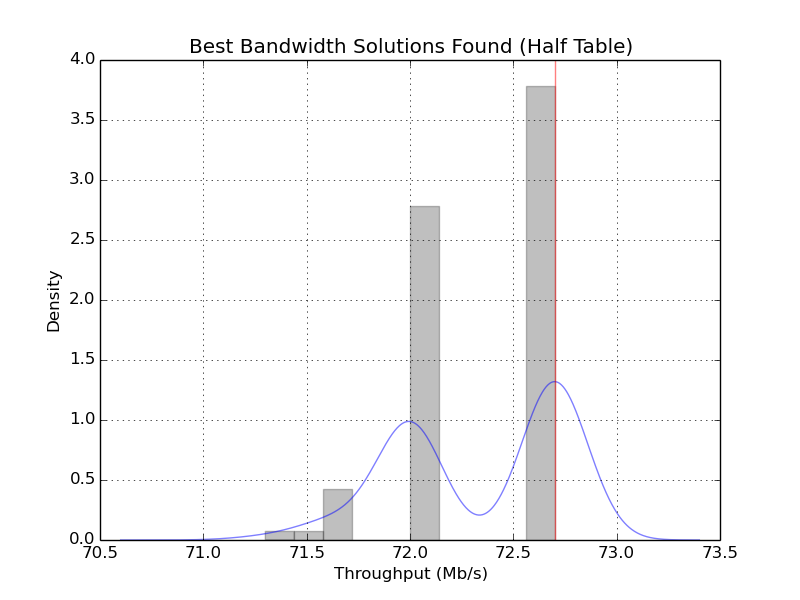
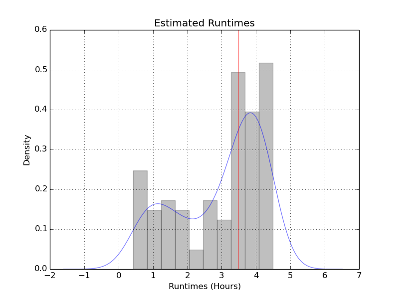

Simulated Annealing With Simulated (Half) Table Data
====================================================

Problem
-------

*How can we understand how the `Simulated Annealing` parameters should be set while trying to optimize device placement on a table?*

This continues the :ref:`Simulated Annealing with Simulated Table Data <case-study-annealing-simulated-table>` problem. Since we found in that case that only half the table had the highest bandwidth, here we'll only use half the data to see how well it does.

.. '

The Simulation Data
-------------------

Recalling that when we plotted the best (70 Mbits/second or more) and worst (less than 10 Mbits/second) data we saw that the best are all on the left-half of the figure.

So here we work with only that sub-set of points.

Sample Configuration File
-------------------------

The only real difference between this and the previous case is that we can't use the GaussianConvolution class because that expects a symmetric (square) space. 

.. '

.. literalinclude:: data/tuna_half_table_settings.ini

TUNA Section
~~~~~~~~~~~~

The ``[TUNA]`` section is a place to list what the plugin sections will be. In this case we're telling the `tuna` that there will only be one plugin and the information to configure it will be in a section named ``[Annealing]``.

DEFAULT Section
~~~~~~~~~~~~~~~

We're going to repeat the simulation 100 times and store the data in a folder named `annealing_tabledata_t0_10000_scale_2` next to the configuration file.

MODULES Section
~~~~~~~~~~~~~~~

We're simulating the use of Cameron's XYTable so we need to tell the `tuna` which module contains the plugin to fake the table's operation. This isn't really needed for the simulation but provides a way to check and see that the `tuna` is calling it the way we expect. The listed module will be imported so the ``xytable`` package has to have been installed for this to work.

Annealing Section
~~~~~~~~~~~~~~~~~

The ``plugin = SimulatedAnnealing`` line tells the tuna to load the `SimulatedAnnealing` class. 

The ``components = fake_table, table_data`` line tells the tuna to create components using the `fake_table` and `table_data` section in this configuration and give it to the Simulated Annealer (wrapped in a :ref:`composite <simple-composite>`). The components will be used to decide how good a location is.

The ``observers = fake_table`` line tells the `tuna` to give the `Simulated Annealer` a copy of the table-mock so that it will call it once it stops. This simulates moving the table to the best solution found at the end of an optimization run.

The ``candidate = 20, 20`` tells the ``tuna`` to tell the Simulated Annealer to start its searching at x=20, y=20.

The ``x_min = 0, x_max = 30`` limits the amount of columns that will be used from the data array to half of the original, while the ``y_min = 0, y_max = 60`` allows all the rows in the data-array to be used.
See the :ref:`XYConvolution <tweaks-xyconvolution>` for more information about how the tweak works.

The Outcome
-----------

How many times did it find the maximum-bandwidth location?
~~~~~~~~~~~~~~~~~~~~~~~~~~~~~~~~~~~~~~~~~~~~~~~~~~~~~~~~~~

Using the log file (`tuna.log`) we can see how the operations went. The file itself is large so I'm going to document what I did but not include the data itself. 

When the `tuna` finds the ideal value (or it exceeds the time limit we set) it outputs "Stop condition reached" along with the coordinates and bandwidth found, which look like this example::

   Stop condition reached with solution: Inputs: [  7.  51.] Output: 72.7

To get the number of cases where 72.7 Mbits/second was found:

.. code-block:: bash

   grep "Stop.*Output:[[:space:]]*72\.7" tuna.log  | wc -l

This gives us 53 compared 30 when it was run with the full table. Not as much of a jump as I'd expected.

How many times did it do well enough?
~~~~~~~~~~~~~~~~~~~~~~~~~~~~~~~~~~~~~

Picking an arbitrary value of 70 Mbits/second as the lower bound of an acceptable bandwidth, how often did the optimizer exceed this lower bound?

.. code-block:: bash

   grep "Quality.*Output:[[:space:]]*7[[:digit:]]" tuna.log  | wc -l

Gave an output of 100. In all cases the `tuna` found a solution that gave at least 70 Mbits/second (as did the full-table search).

How well did it typically do?
~~~~~~~~~~~~~~~~~~~~~~~~~~~~~

By diverting the output from the previous `grep` search to a (:download:`file <data/half_table_bandwidths.log>`) instead of piping it to `wc`, I was able to get the final bandwidths the `tuna` reached (it's included in the "Quality Checks" line as "Output:")::

   Quality Checks: 1486 Solution: Inputs: [  7.  51.] Output: 72.7

.. '

::

    bandwidths = pandas.read_csv('data/half_table_bandwidths.csv')
    description = bandwidths.Bandwidth.describe()
    
    

.. csv-table:: Bandwidth Solutions Summary
   :header: Statistic, Value

   count,100.0
   mean,72.338
   std,0.402462119435
   min,71.3
   25%,72.0
   50%,72.7
   75%,72.7
   max,72.7

So in the worst case it did 71.3 Mbits/second, compared to 70.3 for the full table. To get an idea of a reasonable range for the `mean` bandwidth I'll use a 99% confidence interval. Since the data isn't normal I'll use resampling.

.. '

::

    trials = 10**5
    n = bandwidths.shape[0]
    samples = numpy.random.choice(bandwidths.Bandwidth,
                                  size=(n, trials))
    means = samples.mean(axis=0)
    alpha = 0.01
    p = alpha/2
    
    low = numpy.percentile(means, p)
    high = numpy.percentile(means, 1-p)
    
    

**99% Confidence Interval:** (72.17899995, 72.244)

So if we ran the optimizer often enough and the data always looked like our data set then we would expect the mean of the outcomes to be between 71.9 and 72.0 Mbits/Second 99% of the time. But this isn't really the whole story -- the exhaustive search gets the best value 100% of the time. We're using the optimizer because it's infeasible to run it (the current estimate is 12 hours of execution time). So how long did the optimizer take to get to these values?

.. '

How long were the execution times?
~~~~~~~~~~~~~~~~~~~~~~~~~~~~~~~~~~

To estimate the execution times we need to see how many times the Temperature was changed for each search (the temperature changes before each candidate-check). First a subset of the log was created.

.. code-block:: bash

    grep "Initial\|Temperature" tuna.log > initial_temperatures.log

Then I counted the temperature checks between the "Initial" lines.

::

    repetitions = 0
    out_file = "data/half_table_best_repetitions_counts.csv"
    if not os.path.isfile(out_file):
        with open(out_file, 'w') as w:
            w.write("TemperatureCount\n")
            for line in open("data/half_table_initial_temperatures.log"):
                if "Initial" in line and repetitions !=0:
                    w.write("{0}\n".format(repetitions))
                    repetitions = 0
                    continue
                if "Temperature" in line:
                    repetitions += 1
            w.write("{0}\n".format(repetitions))
    
    

::

    counts = pandas.read_csv(out_file)
    description = counts.TemperatureCount.describe()
    
    

.. csv-table:: Temperature Counts Summary
   :header: Statistic, Value

   count,100
   mean,707.74
   std,298.322
   min,103
   25%,457.75
   50%,837.5
   75%,964
   max,1076

To estimate the running time we have to now pick an arbitrary time for each execution. I'll use 15 seconds on the assumption that the default iperf run-time of 10 seconds is used and it takes 5 seconds to move the table (on average).

.. '

.. math::

   estimate = runtime \times count
   
::

    RUNTIME = 15
    SECONDS_PER_HOUR = 60.0 * 60.0
    
    

.. csv-table:: Estimated Running Times
   :header: Statistic, Running Time (Hours)

   min,0.43
   50%,3.5
   max,4.5

::

    runtimes = counts.TemperatureCount * RUNTIME/SECONDS_PER_HOUR
    samples = numpy.random.choice(runtimes, size=(runtimes.shape[0], trials))
    means = samples.mean(axis=0)
    medians = numpy.median(samples, axis=0)
    low = numpy.percentile(means, p)
    high = numpy.percentile(means, 1-p)
    
    low_median = numpy.percentile(medians, p)
    high_median = numpy.percentile(medians, 1-p)
    
    

**99% Confidence Interval (mean):** (2.45, 2.66)

**99% Confidence Interval (Median):** (2.45, 2.91)

   Estimated running times for each search based on a 15 second iperf/table-movement time.

So it looks like if we wanted to be very sure we got a high-enough solution we would need to let the Annealer run for about four and a half hours. But on average it takes 2.45 to 2.91 hours. This seems counter-inutitive since the actual median was 3.5 hours which is outside of the confidence interval, but I think it's because, looking at the KDE, there looks to be two bunches of data, a low set and a high set, and the low set is large enough that it skews the re-sample lower.
