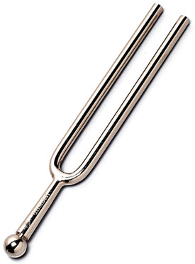

The Tuna
========

   Source: `Wikimedia <http://commons.wikimedia.org/wiki/Category:Tuning_forks#mediaviewer/File:Tuning-fork.jpg>`_

Written Documentation
---------------------

.. toctree::
   
   Developer Documentation <documentation/developer/index>

Auto-Generated Documentation
----------------------------

.. toctree::
   :maxdepth: 1

   Log Setter <log_setter.rst>

.. toctree::
   :maxdepth: 1

   The Components <components/index.rst>
   Explorations <explorations/index.rst>
   The Infrastructure <infrastructure/index.rst>
   Optimizers <optimizers/index.rst>
   The Parts <parts/index.rst>
   The Tuna-Plugins <plugins/index.rst>
   Quality Modules <qualities/index.rst>
   Tweaks <tweaks/index.rst>

