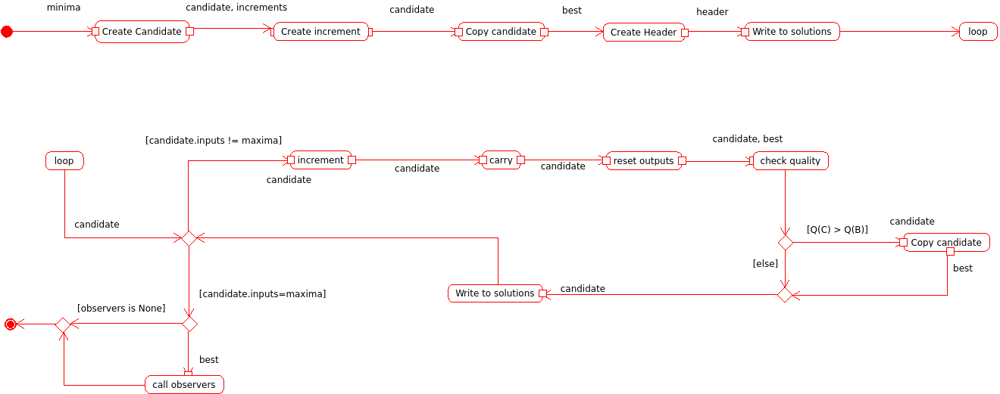

Exhaustive Search
=================

This is an exhaustive grid-search.

Exhaustive Search Constants
---------------------------

These are constants to make building the ExhaustiveSearch object less error-prone.

.. code:: python

    class ExhaustiveSearchConstants(object):
        __slots__ = ()
        # configuration options
        minima_option = 'minima'
        maxima_option = 'maxima'
        increments_option = 'increments'
        datatype_option = 'datatype'
    

Exhaustive Search Implementation
--------------------------------

.. uml::

   BaseComponent <|-- ExhaustiveSearch
   ExhaustiveSearch o- XYSolution
   ExhaustiveSearch o- numpy.array

.. module:: tuna.optimizers.exhaustivesearch
.. autosummary::
   :toctree: api

   ExhaustiveSearch
   ExhaustiveSearch.check_rep
   ExhaustiveSearch.close
   ExhaustiveSearch.carry
   ExhaustiveSearch.__call__

Constructor
~~~~~~~~~~~

The constructor takes five required arguments and one optional argument.

.. csv-table:: ExhaustiveSearch Arguments
   :header: Argument, Type, Description

   ``minima``, numpy array, lowest-allowed coordinates
   ``maxima``, numpy array, highest-allowed coordinates
   ``increment``, numpy array, step-sizes for coordinate changes
   ``quality``, Object, jude of the quality of candidate solutions
   ``solutions``,writeable object, place to write outcome of candidate
   ``observers``,callable object, receiver of best solution found

The Call
~~~~~~~~

The ``__call__`` method is the main way to use the ExhaustiveSearch optimizer.

   

The ExhaustiveSearchBuilder
---------------------------

This is a builder of exhaustive searches.

.. uml::

   ExhaustiveSearchBuilder o- ExhaustiveSearch
   ExhaustiveSearchBuilder o- ConfigurationMap
   ExhaustiveSearchBuilder.product

.. autosummary::
   :toctree: api

   ExhaustiveSearchBuilder
   ExhaustiveSearchBuilder.product
   

