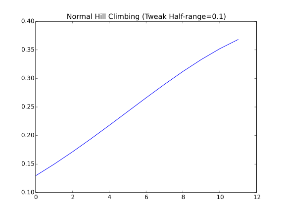
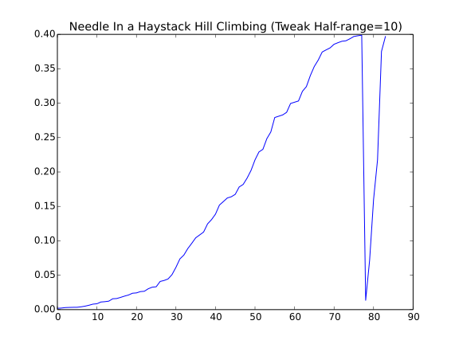

The Hill Climber
================

The HillClimber is the most basic of the local optimizers.

.. uml::

   BaseClimber <|-- HillClimber

.. currentmodule:: optimization.optimizers.hillclimber
.. autosummary::
   :toctree: api

   HillClimber
   HillClimber.__call__

Since this isn't a production-level searcher I'll save the solutions to a list, but once better heuristics are created they should be sent to a persistent target.
   

The HillClimber implements a simple hill-climbing optimization. It has three dependencies:

   * StopCondition
   * Tweak
   * Quality

As well as an initial solution to start the search.

Simulating a Hill Climb
-----------------------

I'll use the simulated data-sets to create an example of how this might work. The first case will be a :ref:`standard-normal curve <optimization-simulations-normal-data>`.

.. '

.. uml::

   HillClimber o- XYSolution
   HillClimber o- XYTweak
   HillClimber o- UniformConvolution
   HillClimber o- StopConditionIdeal
   HillClimber o- NormalSimulation

.. currentmodule:: optimization.simulations.normalsimulation
.. autosummary::
   :toctree: api

   NormalSimulation
.. currentmodule:: optimization.components.stopcondition 
.. autosummary::
   :toctree: api

   StopConditionIdeal
   
.. currentmodule:: optimization.components.convolutions 
.. autosummary::
   :toctree: api

   UniformConvolution
   
.. currentmodule:: optimization.components.xysolution 
.. autosummary::
   :toctree: api

   XYSolution
   XYTweak

::

    IN_PWEAVE = __name__ == '__builtin__'
    #IN_PWEAVE = True
    def run_climber(climber):
        start = time.time()
        solution = climber()
        end = time.time()
        print "solution: {0}".format(solution)
        print "Ideal: {0}".format(simulator.ideal_solution)
        print "Difference: {0}".format(solution.output - simulator.ideal_solution)
        print "Elapsed: {0}".format(end - start)
        return
    
    if IN_PWEAVE:
        from optimization.simulations.normalsimulation import NormalSimulation
        from optimization.components.stopcondition import StopConditionIdeal
        from optimization.components.convolutions import UniformConvolution
        from optimization.components.xysolution import XYSolution, XYTweak
        import time
        import numpy
        import matplotlib.pyplot as plt
    
        simulator = NormalSimulation(domain_start=-4,
                                     domain_end=4,
                                     domain_step=0.1)
    
        stop = StopConditionIdeal(ideal_value=simulator.ideal_solution,
                                  delta=0.0001,
                                  time_limit=300)
        
        tweak = UniformConvolution(half_range=0.1,
                                   lower_bound=simulator.domain_start,
                                   upper_bound=simulator.domain_end)
    
        xytweak = XYTweak(tweak)
        inputs = numpy.random.uniform(simulator.domain_start,
                                      simulator.domain_end,
                                      size=1)
        candidate = XYSolution(inputs=inputs)
    
        # this is a kludge until I get the call-ordering worked out
        # right now the simulator is setting the .output as a side-effect
        simulator(candidate)
        
        climber = HillClimber(solution=candidate,
                              stop_condition=stop,
                              tweak=xytweak,
                              quality=simulator)
        run_climber(climber)
    
    def plot_solutions(filename, climber, title):
        output = 'figures/{0}.svg'.format(filename)
        figure = plt.figure()
        axe = figure.gca()
        data = [solution.output for solution in climber.solutions]
        axe.plot(data)
        axe.set_title(title)
        figure.savefig(output)
        print '.. figure:: '  + output
        return    
    

::

    Inputs: [ 1.54432061] Output: 0.129517595666
    Inputs: [ 1.44609179] Output: 0.149727465636
    Inputs: [ 1.34655045] Output: 0.171368592048
    Inputs: [ 1.24993255] Output: 0.194186054983
    Inputs: [ 1.14995792] Output: 0.217852177033
    Inputs: [ 1.04997088] Output: 0.241970724519
    Inputs: [ 0.94999884] Output: 0.266085249899
    Inputs: [ 0.84999965] Output: 0.289691552761
    Inputs: [ 0.74999983] Output: 0.312253933367
    Inputs: [ 0.64999994] Output: 0.333224602892
    Inputs: [ 0.54999995] Output: 0.352065326764
    Inputs: [ 0.45] Output: 0.368270140303
    solution: Inputs: [ 0.45] Output: 0.368270140303
    Ideal: 0.398942280401
    Difference: -0.0306721400981
    Elapsed: 300.000026941
    

Now a :ref:`Needle in a Haystack <optimization-simulations-needle-in-haystack>` case.

::

    if IN_PWEAVE:
        # make the target different so we know the data changed
        simulator.reset()
        #simulator.functions = [lambda x: 10 * x + 5]
        simulator.domain_start = -100
        simulator.domain_end = 150
        simulator.domain_step = 0.1
        candidate.output = None
        simulator(candidate)
        climber.solution = candidate
    
        stop._end_time = None
        stop.ideal_value = simulator.ideal_solution
    
        # this takes forever, make it lenient
        tweak = UniformConvolution(half_range=1,
                                   lower_bound=simulator.domain_start,
                                   upper_bound=simulator.domain_end)
    
        xytweak = XYTweak(tweak)
    
        stop.delta = 0.001
    
        climber.tweak = xytweak
        print "Ideal: {0}".format(simulator.ideal_solution)
        run_climber(climber)
    

::

    Ideal: 0.398942280401
    Inputs: [ 0.90391236] Output: 0.2660852499
    Inputs: [ 0.40796778] Output: 0.368270140304
    Inputs: [ 0.3038038] Output: 0.381387815461
    Inputs: [ 0.19617259] Output: 0.391042693976
    Inputs: [ 0.01917687] Output: 0.398942280401
    solution: Inputs: [ 0.01917687] Output: 0.398942280401
    Ideal: 0.398942280401
    Difference: 0.0
    Elapsed: 0.00193190574646
    

Running this code can be either very fast (less than a second) or very slow (never reaches the end before timing out). I'm not going to bother trying it on the harder data-sets.
