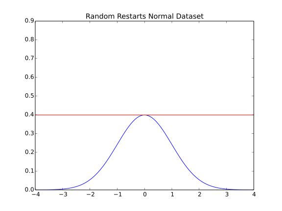

Hill-Climbing with Random Restarts
==================================

*Hill-Climbing With Random Restarts* generalizes hill-climbing to make a global classifier _[EOM]. It does this by periodically restarting in a new spot. To enable the restarting, an inner-loop is created that runs for the amount of time (repetitions?) chosen from a distribution of times. Once the time for the inner loop is finished a new candidate is randomly generated and process restarts until the total time expires or the ideal solution is found (in the theoretical case).

.. module:: tuna.optimizers.randomrestarts
.. autosummary::
   :toctree: api

   RandomRestarts
   RandomRestarts.__call__
   RandomRestarts.solution
   RandomRestarts.solutions
   RandomRestarts.is_ideal
   RandomRestarts.reset

Example Use
-----------

First we'll start with the normal distribution. 

.. '

::

    IN_PWEAVE = __name__ == '__builtin__'
    if IN_PWEAVE:
        # python standard library
        import datetime
        
        # helpers for weaving
        from examples.pweave_helpers import run_climber, plot_dataset    
    
        # actual builder code
        from tuna.tweaks.convolutions import UniformConvolution
        from tuna.qualities.normalsimulation import NormalSimulation
        from tuna.parts.xysolution import XYSolutionGenerator, XYTweak
        from tuna.parts.stopcondition import StopConditionGenerator
    
        simulator = NormalSimulation(domain_start=-4,
                                     domain_end=4,
                                     steps=1000)
    
        stop_conditions = StopConditionGenerator(time_limit=datetime.timedelta(seconds=300),
                                                 maximum_time=0,
                                                 minimum_time=0,
                                                 ideal=simulator.ideal_solution,
                                                 delta=0.000000001)
        tweak = UniformConvolution(half_range=0.1,
                                   lower_bound=simulator.domain_start,
                                   upper_bound=simulator.domain_end)
        xy_tweak = XYTweak(tweak)
        candidates = XYSolutionGenerator(low=simulator.domain.min(),
                                         high=simulator.domain.max())
        
        climber = RandomRestarts(stop_conditions=stop_conditions,
                                 candidates=candidates,
                                 quality=simulator,
                                 tweak=xy_tweak)
    
        run_climber(climber)    
    

::

    Inputs: [-0.75312272] Output: 0.299608418784
    Inputs: [-0.08161326] Output: 0.397534482667
    Inputs: [-0.04712304] Output: 0.39855551836
    Inputs: [ 0.012015] Output: 0.398913500061
    Inputs: [ 0.00029378] Output: 0.398939082483
    Solution: Inputs: [ 0.00029378] Output: 0.398939082483
    Ideal: 0.398939082483
    Difference: 0.0
    Elapsed: 0.010586977005
    Quality Checks: 495
    Comparisons: 247.0
    Solutions: 5
    Solutions/Comparisons: 0.0202429149798
    

